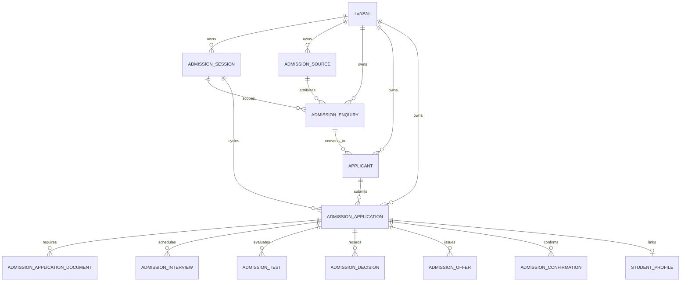

# STEP 11 — V2 WAVE 2: ADMISSIONS & ENQUIRY CRM
## Production Implementation Specification — Multi-Tenant, Secure, Finance-Integrated

---

## 1. Executive Summary & Objective

**Phase**: V2 Wave 2 — Admissions & Enquiry CRM  
**Mission**: Deliver a production-grade, multi-tenant admissions and enquiry lifecycle management subsystem covering prospective lead tracking, duplicate detection, formal applications, document verification, assessment scheduling, review and decisions, conditional/unconditional offers, admission confirmation, and atomic student conversion.

### Core Architectural Precedents & Guardrails:
1. **Zero Second Identity System**: Clerk authenticates identity only. PostgreSQL application models (`User`, `Tenant`, `TenantMembership`, `Role`, `Permission`, `AccessScope`, `ModuleEntitlement`) remain authoritative for RBAC and access boundaries.
2. **Zero Second Student Model**: No parallel student identity. Enrolling an applicant at `ADMITTED` status creates or reuses the existing `StudentProfile`, `StudentEnrollment`, `ParentProfile`, and `StudentParentBinding` models.
3. **Zero Second Payment / Ledger System**: All fee assignments, application fee invoices, and payment confirmations route through existing Wave 1 financial boundaries (`FeeService`, `PaymentService`, `LedgerService`). Admissions code does not mutate financial tables or post journal entries directly.
4. **Tenant Isolation**: Every admissions record carries `tenantId` with composite unique constraints and database indexes. Cross-tenant references are strictly prohibited.
5. **State Machine Integrity**: Client-controlled arbitrary status mutation is blocked. Server-side state machine validates all transitions.

---

## 2. Bounded Context & Admissions Domain Model

Plane 14 was introduced into `prisma/schema.target.prisma` with 11 normalized, tenant-scoped models:



### Domain Models Summary:
1. **`AdmissionSession`**: Institutional academic intake session (`UPCOMING`, `OPEN`, `CLOSED`, `ARCHIVED`) bound to an `AcademicYear`.
2. **`AdmissionSource`**: Lead source categorization (`WALK_IN`, `WEBSITE`, `REFERRAL`, `SOCIAL_MEDIA`, `EVENT`, `EDUCATION_FAIR`, `CAMPAIGN`, `OTHER`).
3. **`AdmissionEnquiry`**: Prospective student enquiry CRM record with owner assignment, lead status, and conversion tracking.
4. **`Applicant`**: Normalized prospective student identity with demographic attributes, duplicate detection flags, and guardian contact.
5. **`AdmissionApplication`**: Formal application submitted for a specific session, grade, and optional section.
6. **`AdmissionApplicationDocument`**: Document verification record referencing `DocumentReference` (Cloudflare R2 storage key, MIME, checksum; zero binary blobs in PG).
7. **`AdmissionInterview`**: Candidate interview evaluation record with scheduled time, interviewer, score, and recommendation.
8. **`AdmissionTest`**: Entrance examination record with test type, scheduled date, pass mark, score, and pass/fail result.
9. **`AdmissionDecision`**: Formal institutional decision (`APPROVED`, `REJECTED`, `WAITLISTED`) with reasoning and deciding officer audit.
10. **`AdmissionOffer`**: Formal admission offer with offered grade/class, validity/expiry date, terms metadata, and acceptance state.
11. **`AdmissionConfirmation`**: Prerequisite-validated admission confirmation with financial reference linkage and confirmation number.

---

## 3. Admissions Lifecycle & State Machine

### 3.1 Enquiry CRM Lifecycle:
$$\text{NEW} \longrightarrow \text{CONTACTED} \longrightarrow \text{QUALIFIED} \longrightarrow \text{CONVERTED} \quad (\text{or } \text{LOST} / \text{CLOSED})$$

- Conversion: Converting an enquiry creates an `Applicant` record, marks the enquiry as `CONVERTED`, sets `convertedAt`, and links `convertedApplicantId`. Emits `admissions.enquiry.converted`.

### 3.2 Application State Machine:
```
DRAFT
  ↓
SUBMITTED
  ↓
UNDER_REVIEW ⇄ DOCUMENTS_PENDING / DOCUMENTS_VERIFIED
  ↓
INTERVIEW_PENDING / TEST_PENDING
  ↓
DECISION_PENDING
  ↓
APPROVED / REJECTED / WAITLISTED
  ↓
OFFERED
  ↓
CONFIRMED
  ↓
ADMITTED (Terminal State)
```

- **Validation**: Any attempt to bypass prerequisites (e.g. confirming admission without verified documents or without valid offer acceptance) throws `ValidationError`.
- **Cancellation**: Permitted from non-terminal states with required reason logging.

---

## 4. Deterministic Duplicate Detection Strategy

To prevent redundant applicant profiles and silent data corruption, `AdmissionsService.detectDuplicates()` executes deterministic matching across existing `Applicant` and `StudentProfile` tables within the tenant:

- **Exact Match (`EXACT_MATCH`)**:
  - Matched `maskedNationalId`, OR
  - Normalized full name (lowercase, collapsed whitespace) + Date of Birth (YYYY-MM-DD) + Normalized 10-digit guardian phone.
  - Action: Blocks applicant creation with `ConflictError` unless explicitly resolved.
- **Possible Match (`POSSIBLE_MATCH`)**:
  - Matched Name + DOB (different phone), OR
  - Matched Name + Guardian Phone (different DOB).
  - Action: Flags applicant with `status = "DUPLICATE_FLAGGED"`, captures `duplicateMatchId` and `duplicateNotes`. Requires explicit administrative override (`forceCreateIfDuplicate`) to proceed.
- **No Silent Merge**: Merge mutations are forbidden without human administrative authorization.

---

## 5. Critical Boundary: Student & Guardian Conversion

When an application transitions to `ADMITTED`:
1. **Idempotency Guarantee**: If an application is already in `ADMITTED` status with an assigned `studentProfileId`, subsequent calls return the existing student profile and enrollment without creating duplicate records.
2. **Student Profile Creation / Linking**:
   - Reuses matching student if already registered in the tenant.
   - Otherwise, generates unique `admissionNumber` (`ADM-{year}-{seq}`) and creates `StudentProfile`.
3. **Student Enrollment Creation**:
   - Creates `StudentEnrollment` for the target academic year, grade, and class with calculated roll number.
4. **Guardian / Parent Profile Handling**:
   - Checks existing `ParentProfile` matching `applicant.guardianPhone`.
   - Reuses existing parent if found; creates new profile if absent.
   - Creates `StudentParentBinding` (`isPrimaryContact: true`, `isFeePayer: true`).
5. **Audit & Event Emission**:
   - Logs `actionCategory: "ADMISSIONS"`, `action: "STUDENT_ADMITTED"` in `AuditLog`.
   - Emits transactional outbox event: `admissions.student.admitted`.

---

## 6. Wave 1 Financial Integration

1. **Separation of Concerns**: Admissions officers (`ADMISSIONS_OFFICER`) possess permissions for student admissions (`admissions.*`), but do NOT possess financial posting or refund permissions (`finance.post`, `fees.refund`).
2. **Fee Invoicing & Payment**:
   - Admissions operations invoke `FeeService` or `PaymentService` boundaries.
   - Applications bind to `feeInvoiceId` and `financialReference`.
   - Confirmation checks whether tenant policy requires fee settlement before confirming admission.

---

## 7. Granular RBAC Permissions & AccessScopes

### New Module: `admissions_module`
- Default: Disabled unless institutional subscription entitles it.
- Inactive access: Returns HTTP 402 `ModuleDisabledError`.

### Granular Permissions (13):
- `admissions.read` — View enquiries, applicants, and admission applications.
- `admissions.create` — Create prospective enquiries and applications.
- `admissions.update` — Update enquiry and applicant details.
- `admissions.manage` — Manage admission sessions and sources.
- `admissions.review` — Review and evaluate admission applications.
- `admissions.verify_documents` — Verify or reject applicant uploaded documents.
- `admissions.schedule_interview` — Schedule applicant interviews and tests.
- `admissions.record_result` — Record interview notes and test results.
- `admissions.decide` — Make admission decisions (approve, reject, waitlist).
- `admissions.offer` — Generate and manage admission offers.
- `admissions.admit` — Confirm admission and convert to enrolled student.
- `admissions.cancel` — Cancel enquiries, applications, and offers.
- `admissions.export` — Export admissions lists and funnel metrics.

### AccessScopes:
- `INSTITUTION_WIDE`: Unrestricted tenant admissions visibility (Owners, Principals, Admissions Officers).
- `ASSIGNED_ONLY`: Counselors/reviewers can only access applications and enquiries where `reviewerUserId === userId` or `ownerUserId === userId`.
- `SELF_ONLY`: Prospective applicants can only view their own applications.
- `LINKED_CHILDREN`: Parents/guardians can only view applications for children where `guardianPhone === parent.primaryPhone` or bound via `StudentParentBinding`.
