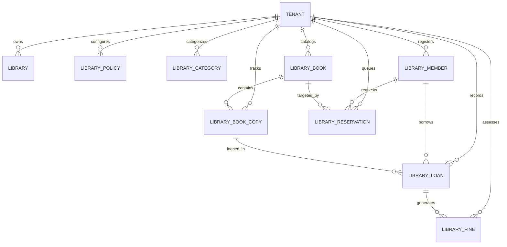
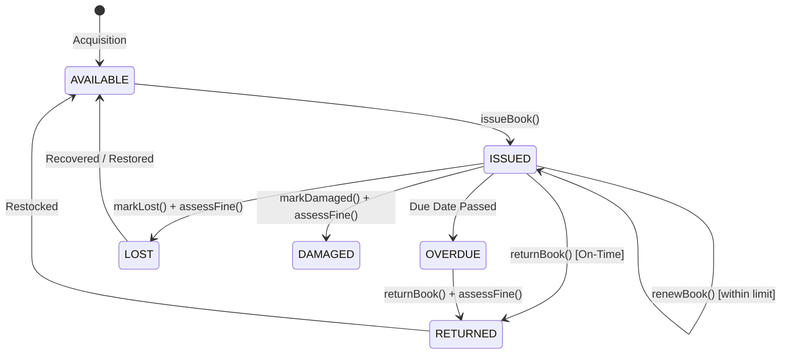
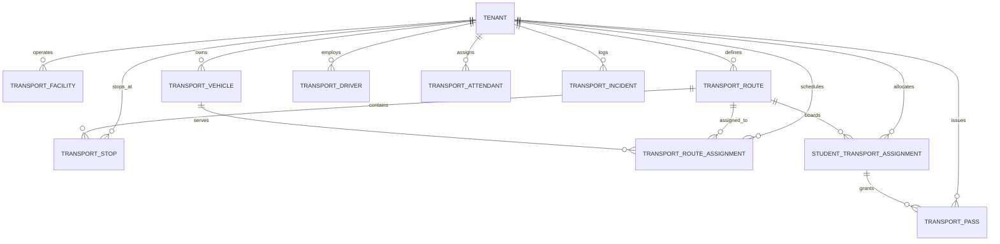

# STEP 13 — V2 WAVE 3: LIBRARY & TRANSPORT
## Production Implementation Specification — Multi-Tenant, Secure, Financially Integrated

---

## 1. Executive Summary & Mission

**Phase**: V2 Wave 3 — Library & Transport Management  
**Mission**: Deliver production-grade, multi-tenant, authorization-safe, auditable, and financially integrated domain modules for:
1. **Library Management**: Cataloging (books, categories, authors, publishers), physical copies / inventory, membership binding, circulation (issue, return, renewal, reservation), and deterministic overdue/damage/loss fines with financial ledger integration.
2. **Transport Management**: Route management, sequenced stops, vehicle fleet tracking, driver and attendant assignment, student transport allocation, digital pass generation, strict capacity enforcement, and operational incident reporting.

---

## 2. Core Architectural Precedents & Guardrails

1. **Clerk Authentication Only**: Clerk provides user authentication only. The PostgreSQL database is authoritative for application authorization, RBAC, access scopes, and multi-tenant domain data.
2. **Zero Duplicate Identities**:
   - Library members reference existing `StudentProfile`, `User` (staff), or `ParentProfile` entities.
   - Transport drivers and attendants reuse existing `User` and `StaffProfile` records.
   - Student transport assignments link directly to existing `StudentProfile` and `AcademicYear` entities.
3. **Zero Direct Financial Entries**:
   - Library fines and transport fees integrate strictly through existing Wave 1 financial service boundaries (`FeeService`, `PaymentService`, `LedgerService`).
   - No direct General Ledger manipulation or standalone library/transport payment tables.
4. **Independent Module Entitlement Gating**:
   - `library_module` and `transport_module` both default to **disabled** (`isEnabled: false`).
   - Accessing disabled modules yields `HTTP 402 Payment Required` (`ModuleDisabledError`).
   - Tenant-specific activation allows running Library ON / Transport OFF or vice-versa.
5. **Multi-Tenant Scoping**:
   - Every library and transport model carries `tenantId`.
   - Cross-tenant queries and cross-tenant foreign key references are rejected at the database and application levels.
6. **Strict Concurrency & Invariant Enforcement**:
   - Book copies cannot be simultaneously issued to multiple members.
   - Vehicle capacities cannot be exceeded.
   - Returns, renewals, and fine settlements are idempotent.

---

## 3. Library Bounded Context & Domain Architecture

### 3.1 Domain Models (Plane 15 in `schema.target.prisma`)

1. **`Library`**: Physical or departmental institutional library facility.
2. **`LibraryPolicy`**: Configurable rules (loan period in days, max active loans, renewal limit, fine per day in cents, grace period days, reservation expiry days).
3. **`LibraryCategory`**: Classification hierarchy (Textbook, Reference, Fiction, Non-Fiction, Periodical).
4. **`LibraryAuthor` & `LibraryPublisher`**: Bibliographic metadata entities.
5. **`LibraryBook`**: Bibliographic title (ISBN, title, subtitle, edition, language, category, author, publisher).
6. **`LibraryBookCopy`**: Physical inventory unit (accession number, barcode, condition, status: `AVAILABLE`, `ISSUED`, `RESERVED`, `LOST`, `DAMAGED`, `WITHDRAWN`, location).
7. **`LibraryMember`**: Institutional library patron bound to `StudentProfile` or `User` with member type (`STUDENT`, `STAFF`, `PARENT`, `OTHER`).
8. **`LibraryLoan`**: Circulation issue record (issuedAt, dueAt, returnedAt, status: `ISSUED`, `RETURNED`, `OVERDUE`, `LOST`, `CANCELLED`, renewalCount).
9. **`LibraryReservation`**: Title reservation queue (requestedAt, status: `PENDING`, `FULFILLED`, `CANCELLED`, `EXPIRED`).
10. **`LibraryFine`**: Assessed fines for overdue returns or damaged/lost copies (amount, reason, status: `UNPAID`, `PAID`, `WAIVED`, `CANCELLED`, financialReference).

### 3.2 Circulation Lifecycle & Invariants

- **Single-Issue Guarantee**: `LibraryBookCopy` status must be `AVAILABLE` and transitions atomically to `ISSUED` inside a database transaction.
- **Quota Enforcement**: Members cannot exceed `maxActiveLoans` configured in `LibraryPolicy`.
- **Deterministic Fine Calculation**: `fineAmount = max(0, overdueDays - gracePeriodDays) * finePerDayCents`.
- **Idempotent Fine Settlement**: Settling an `UNPAID` fine transitions it to `PAID` with financial receipt/transaction reference; duplicate settlement attempts throw `ConflictError`.

---

## 4. Transport Bounded Context & Domain Architecture

### 4.1 Domain Models (Plane 16 in `schema.target.prisma`)

1. **`TransportFacility`**: Depot or operational base with contact metadata.
2. **`TransportRoute`**: Transit line (routeCode, name, direction: `INBOUND`, `OUTBOUND`, `BIDIRECTIONAL`, operatingDays, schedule).
3. **`TransportStop`**: Sequenced pickup and drop stations along a route (sequence, pickupTime, dropTime, landmark, coordinates).
4. **`TransportVehicle`**: Fleet unit (registrationNumber, vehicleType, capacity, status: `ACTIVE`, `INACTIVE`, `MAINTENANCE`, `RETIRED`).
5. **`TransportDriver` & `TransportAttendant`**: Operational staff linking to application `User` and `StaffProfile` with license and verification details.
6. **`TransportRouteAssignment`**: Operational pairing of route, vehicle, driver, attendant, and shift (`MORNING`, `AFTERNOON`, `EVENING`, `FULL_DAY`).
7. **`StudentTransportAssignment`**: Link between `StudentProfile`, route, pickup stop, drop stop, academic year, and status (`ACTIVE`, `PENDING`, `SUSPENDED`, `TERMINATED`).
8. **`TransportPass`**: Digital boarding pass record with unique passNumber and validity dates.
9. **`TransportIncident`**: Operational log (breakdown, delay, route disruption, safety incident) with severity (`LOW`, `MEDIUM`, `HIGH`, `CRITICAL`) and resolution tracking.

### 4.2 Transport Capacity & Route Invariants

- **Strict Capacity Ceiling**: An assignment is rejected with `ConflictError` if the route's assigned vehicle capacity is fully occupied by active student assignments.
- **Route Stop Integrity**: The selected `pickupStopId` and `dropStopId` must belong to the assigned `routeId`.
- **Single Active Route**: A student cannot have overlapping `ACTIVE` transport assignments for the same academic year unless explicitly permitted.
- **Operational Vehicle Status**: Inactive, retired, or maintenance-status vehicles cannot be deployed on active route assignments.

---

## 5. Security & Authorization Architecture

### 5.1 Permissions Catalog

**Library (11 Permissions)**:
- `library.read`: View catalog, copies, loans, reservations, fines, and reports.
- `library.create`: Create books, copies, categories, authors, publishers, members.
- `library.update`: Update catalog details, member status, book copy status.
- `library.manage`: Configure library facilities, policies, rules.
- `library.issue`: Check out / issue physical copies to members.
- `library.return`: Check in / receive returned copies, assess overdue state.
- `library.renew`: Renew active loans within policy limits.
- `library.reserve`: Place title reservations for members.
- `library.fine`: Manually assess circulation or damage fines.
- `library.waive_fine`: Authorize fine waiver with mandatory reason.
- `library.export`: Export catalog and circulation reports to CSV.

**Transport (9 Permissions)**:
- `transport.read`: View routes, stops, fleet, staff assignments, passenger rosters.
- `transport.create`: Create routes, stops, vehicles, drivers, attendants.
- `transport.update`: Update routes, stops, vehicle specs, staff details.
- `transport.manage`: Configure facilities and global transport settings.
- `transport.route_manage`: Schedule vehicles, drivers, attendants to routes.
- `transport.vehicle_manage`: Manage fleet status, maintenance schedules, registrations.
- `transport.assignment_manage`: Assign or remove students from transport routes.
- `transport.incident_manage`: Log, escalate, and resolve operational incidents.
- `transport.export`: Export transport rosters, stops, and incident logs.

### 5.2 AccessScope Enforcement

- **`INSTITUTION_WIDE`**: LIBRARIAN, TRANSPORT_COORDINATOR, PRINCIPAL, ADMIN can view all tenant records.
- **`ASSIGNED_ONLY`**: Transport drivers/attendants can access only their assigned routes and rosters.
- **`SELF_ONLY`**: Students can access only their own loans, reservations, fines, and transport pass.
- **`LINKED_CHILDREN`**: Parents can access library and transport details only for children verified via `StudentParentBinding`.

---

## 6. Financial Integration

- **Library Fines**:
  - Library circulation assesses fines into `LibraryFine`.
  - Settlements use `feeService` or `paymentService` to record receipts without direct General Ledger manipulation.
  - Sub-ledger and General Ledger balances remain in complete double-entry reconciliation.
- **Transport Fees**:
  - Route assignment records optional `feeAssignmentId`.
  - Invoicing and fee collection execute through Wave 1 `FeeStructure` and `FeeComponent` structures.

---

## 7. Audit Logging & Outbox Events

All state mutations record structured audit logs (`AuditActionCategory.LIBRARY` and `AuditActionCategory.TRANSPORT`) and emit transactional outbox events:
- `library.book.created`, `library.copy.created`, `library.book.issued`, `library.book.returned`, `library.book.renewed`, `library.reservation.created`, `library.fine.assessed`, `library.fine.waived`, `library.fine.settled`
- `transport.route.created`, `transport.stop.created`, `transport.vehicle.assigned`, `transport.driver.assigned`, `transport.student.assigned`, `transport.student.unassigned`, `transport.incident.created`, `transport.incident.resolved`
