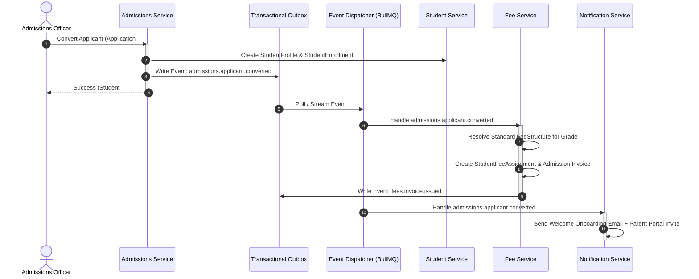
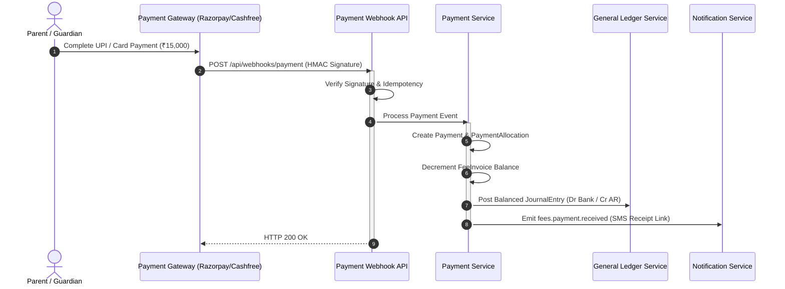

# Step 8: V2 Domain Events & Asynchronous Integration Architecture

**Project**: SchoolyardSMS / Justezy Multi-Tenant Education SaaS  
**Phase**: Step 8 — V2 Architecture & Roadmap  
**Date**: September 26, 2026  
**Status**: APPROVED SPECIFICATION  

---

## 1. Domain Event Architecture Overview

In V2, cross-module communication adheres to the **Event-Driven Architecture (EDA)** pattern. When significant domain mutations occur, domain services emit immutable **Domain Events**.

### Core Principles
1. **Decoupled Workflows**: Upstream business domains (e.g. Fees) never directly invoke downstream integration logic (e.g. SMS dispatch, General Ledger posting).
2. **Transactional Outbox Pattern**: Events are stored in PostgreSQL within the same database transaction as the business mutation, guaranteeing zero message loss.
3. **At-Least-Once Delivery**: Events are dispatched to worker queues with exponential backoff retries.
4. **Subscriber Idempotency**: Downstream subscribers must verify `eventId` before processing to prevent duplicate side-effects.
5. **Strict Tenant Context Propagation**: Every event carries `tenantId`. Handlers execute within `runWithTenantContext`.

---

## 2. Standardized Event Envelope Specification

Every event emitted in the system conforms to the standard JSON envelope:

```typescript
export interface DomainEventEnvelope<T = any> {
  eventId: string;             // Globally unique cuid() or uuidv4
  eventType: string;           // E.g. "fees.invoice.issued"
  eventVersion: string;        // E.g. "1.0"
  occurredAt: string;          // ISO 8601 UTC timestamp
  tenantId: string;            // Mandatory institutional tenant boundary
  actorId?: string;            // User ID who triggered the action (or "SYSTEM")
  actorEmail?: string;         // User email for auditing
  correlationId: string;       // Request trace / correlation ID
  payload: T;                  // Typed domain-specific payload
}
```

---

## 3. V2 Domain Events Catalog

### 3.1 Fees & Collections Domain Events
| Event Type | Event Version | Trigger | Payload Summary | Downstream Subscribers |
| :--- | :---: | :--- | :--- | :--- |
| `fees.assignment.created` | 1.0 | Student fee structure assigned | `assignmentId, studentId, feeStructureId, netAmount` | NotificationService (Parent notification) |
| `fees.invoice.issued` | 1.0 | Fee invoice finalized & issued | `invoiceId, invoiceNumber, studentId, dueDate, balanceAmount` | NotificationService (Invoice notice), LedgerService |
| `fees.invoice.voided` | 1.0 | Invoice canceled or voided | `invoiceId, invoiceNumber, reason` | LedgerService (Reversal entry) |
| `fees.payment.received` | 1.0 | Payment recorded (online/offline) | `paymentId, receiptNumber, studentId, amount, paymentMode` | NotificationService (Receipt SMS/Email), LedgerService |
| `fees.payment.allocated` | 1.0 | Payment applied to invoice lines | `paymentId, invoiceId, allocatedAmount, remainingBalance` | ReportingService (Collection analytics) |
| `fees.refund.processed` | 1.0 | Fee refund executed | `refundId, paymentId, amount, reason` | LedgerService (Bank credit reversal), NotificationService |

### 3.2 Financial General Ledger Domain Events
| Event Type | Event Version | Trigger | Payload Summary | Downstream Subscribers |
| :--- | :---: | :--- | :--- | :--- |
| `finance.journal.posted` | 1.0 | Balanced journal entry committed | `journalEntryId, entryNumber, sourceType, sourceId, totalAmount` | AuditService, AnalyticsService |
| `finance.period.closed` | 1.0 | Financial fiscal period locked | `periodId, fiscalYearId, periodNumber` | AuditService, NotificationService (Admin alert) |

### 3.3 Admissions CRM Domain Events
| Event Type | Event Version | Trigger | Payload Summary | Downstream Subscribers |
| :--- | :---: | :--- | :--- | :--- |
| `admissions.enquiry.created` | 1.0 | New lead / prospective student | `enquiryId, enquiryNumber, parentPhone, gradeLevel` | NotificationService (Welcome SMS), AdmissionWorker |
| `admissions.application.submitted` | 1.0 | Digital application submitted | `applicationId, applicationNumber, applicantName, appliedGrade` | NotificationService, AdmissionReviewQueue |
| `admissions.offer.issued` | 1.0 | Admission acceptance offer sent | `offerId, offerCode, applicationId, expiryDate, admissionFee` | NotificationService (Offer letter & payment link) |
| `admissions.applicant.converted` | 1.0 | Confirmed applicant enrolled | `applicationId, studentId, admissionNumber, classId` | AcademicService, FeeService (Assign Initial Fees) |

### 3.4 Library Domain Events
| Event Type | Event Version | Trigger | Payload Summary | Downstream Subscribers |
| :--- | :---: | :--- | :--- | :--- |
| `library.book.issued` | 1.0 | Book copy borrowed | `borrowRecordId, membershipId, bookCopyId, dueDate` | NotificationService (Due date reminder schedule) |
| `library.book.returned` | 1.0 | Book copy returned | `borrowRecordId, bookCopyId, returnDate, condition` | InventoryService (Book inventory update) |
| `library.fine.imposed` | 1.0 | Overdue fine calculated | `fineId, borrowRecordId, amount, daysOverdue` | FeeService (Optional: add fine to student fee invoice) |

### 3.5 Transport Domain Events
| Event Type | Event Version | Trigger | Payload Summary | Downstream Subscribers |
| :--- | :---: | :--- | :--- | :--- |
| `transport.assignment.created` | 1.0 | Student assigned to bus route | `assignmentId, studentId, routeId, stopId, monthlyFare` | FeeService (Add transport fee component) |
| `transport.route.delayed` | 1.0 | Driver reports route delay | `routeId, stopId, delayMinutes, reason` | NotificationService (Urgent SMS to parents of stop) |

### 3.6 Inventory & Assets Domain Events
| Event Type | Event Version | Trigger | Payload Summary | Downstream Subscribers |
| :--- | :---: | :--- | :--- | :--- |
| `inventory.stock.received` | 1.0 | Vendor goods inward receipt | `batchId, itemId, vendorId, quantity, unitCost` | LedgerService (Inventory Asset debit, Vendor Payable credit) |
| `inventory.stock.low` | 1.0 | Stock reaches reorder threshold | `itemId, currentStock, threshold` | NotificationService (Storekeeper alert) |
| `inventory.asset.assigned` | 1.0 | Fixed asset assigned to staff | `assignmentId, assetId, staffId, assignedDate` | HRService (Update staff asset dossier) |

### 3.7 HR & Payroll Domain Events
| Event Type | Event Version | Trigger | Payload Summary | Downstream Subscribers |
| :--- | :---: | :--- | :--- | :--- |
| `hr.leave.approved` | 1.0 | Staff leave request approved | `leaveRequestId, staffId, leaveType, daysCount` | PayrollService (Deduct from leave balance / unpaid LOP) |
| `payroll.run.approved` | 1.0 | Monthly payroll finalized | `payrollRunId, month, year, totalGross, totalNet` | LedgerService (Salary Expense debit, Bank/Payable credit) |
| `payroll.payslip.disbursed` | 1.0 | Payout reference recorded | `payslipId, staffId, netPayable, paymentMode` | NotificationService (Payslip ready notification) |

---

## 4. Cross-Domain Choreography Examples

### Flow A: Admissions Conversion to Enrolled Student & Fee Assignment


### Flow B: Online Payment Receipt & Automated General Ledger Posting


---

## 5. Idempotency & Failure Recovery

1. **Transactional Outbox Table**:
   - Outbox table in database: `OutboxEvent (id, tenantId, eventType, payloadJson, status: PENDING | SENT | FAILED, retryCount, createdAt)`.
   - Written within the same database transaction as the state change.
2. **Deduplication Key**:
   - `consumer_id + event_id` cached in Redis or tracked in `ProcessedEvent` table with a 7-day TTL.
3. **Dead Letter Queue (DLQ)**:
   - Events failing after 5 retries with exponential backoff (1s, 5s, 30s, 2m, 10m) are routed to `event-dlq` and alert administrators via Sentry/monitoring webhooks.
