# Section C: Application Architecture Audit

## 1. High-Level Architectural Pattern

The current codebase is built on **Next.js 14 App Router** using a hybrid architecture of React Server Components (RSC) and React Client Components, with data persistence handled via Prisma ORM and identity managed through Clerk.

```mermaid
flowchart TD
    subgraph ClientLayer ["Client Layer (Browser / Mobile Browser)"]
        UI_Login["Login Page ([[...sign-in]])<br/>@clerk/elements"]
        UI_Shell["Dashboard Layout Shell<br/>(Sidebar Menu + Navbar + UserButton)"]
        UI_Dashboard["Role Dashboards<br/>(/admin, /teacher, /student, /parent)"]
        UI_Lists["List Screens (10 modules)<br/>(/list/teachers, /list/students, etc.)"]
        UI_Forms["Form Modals & Client Inputs<br/>(react-hook-form + zod)"]
        CldWidget["Cloudinary Upload Widget<br/>(Unsigned Client Upload)"]
    end

    subgraph EdgeMiddleware ["Next.js Edge Middleware"]
        MW["src/middleware.ts<br/>(clerkMiddleware)"]
        RAM["src/lib/settings.ts<br/>(routeAccessMap)"]
        MW --> RAM
    end

    subgraph ServerComponents ["Next.js Server Runtime (RSC)"]
        RSC_Admin["admin/page.tsx<br/>(Direct Prisma Queries)"]
        RSC_Teacher["teacher/page.tsx<br/>(Teacher lessons query)"]
        RSC_Student["student/page.tsx<br/>(Student class query)"]
        RSC_Parent["parent/page.tsx<br/>(Parent children query)"]
        RSC_Lists["list/*/page.tsx<br/>(Manual role switch + pagination)"]
        RSC_Containers["Chart & Calendar Containers<br/>(Aggregations & Date math)"]
    end

    subgraph ServerActions ["Server Actions (src/lib/actions.ts)"]
        SA_Subject["create/update/delete Subject"]
        SA_Class["create/update/delete Class"]
        SA_Teacher["create/update/delete Teacher"]
        SA_Student["create/update/delete Student"]
        SA_Exam["create/update/delete Exam"]
    end

    subgraph ThirdPartyAuth ["Third-Party Identity Provider"]
        ClerkAPI["Clerk Backend API<br/>(clerkClient.users)"]
        ClerkSession["Clerk Session Token<br/>(sessionClaims.metadata.role)"]
    end

    subgraph DatabaseLayer ["Database (PostgreSQL via Prisma ORM)"]
        PrismaSingleton["Prisma Client Singleton<br/>(src/lib/prisma.ts)"]
        PG_DB[("PostgreSQL Database<br/>(Single Flat Schema)")]
    end

    subgraph ExternalStorage ["External Storage"]
        CloudinaryCDN["Cloudinary Media CDN"]
    end

    UI_Login -->|"Sign-in credentials"| ClerkAPI
    ClerkAPI -->|"JWT with publicMetadata.role"| UI_Login
    UI_Login -->|"Redirect /${role}"| MW
    MW -->|"Role check via JWT sessionClaims"| UI_Shell

    UI_Shell --> UI_Dashboard
    UI_Shell --> UI_Lists
    UI_Lists --> UI_Forms
    UI_Forms --> CldWidget
    CldWidget -->|"Direct upload"| CloudinaryCDN

    UI_Dashboard --> RSC_Admin & RSC_Teacher & RSC_Student & RSC_Parent
    UI_Lists --> RSC_Lists
    RSC_Admin --> RSC_Containers
    RSC_Teacher --> RSC_Containers
    RSC_Student --> RSC_Containers
    RSC_Parent --> RSC_Containers

    RSC_Admin -->|"Direct prisma.*.findMany/count"| PrismaSingleton
    RSC_Teacher -->|"Direct prisma.*"| PrismaSingleton
    RSC_Student -->|"Direct prisma.*"| PrismaSingleton
    RSC_Parent -->|"Direct prisma.*"| PrismaSingleton
    RSC_Lists -->|"Direct prisma.$transaction([findMany, count])"| PrismaSingleton
    RSC_Containers -->|"Direct prisma.*"| PrismaSingleton

    UI_Forms -->|"useFormState() formAction"| ServerActions
    SA_Teacher -->|"clerkClient.users.createUser()"| ClerkAPI
    SA_Student -->|"clerkClient.users.createUser()"| ClerkAPI
    SA_Teacher -->|"prisma.teacher.create()"| PrismaSingleton
    SA_Student -->|"prisma.student.create()"| PrismaSingleton
    SA_Subject -->|"prisma.subject.*"| PrismaSingleton
    SA_Class -->|"prisma.class.*"| PrismaSingleton
    SA_Exam -->|"prisma.exam.*"| PrismaSingleton

    PrismaSingleton --> PG_DB
```

---

## 2. Server / Client Boundaries

1. **Root & Dashboard Shell**:
   - `src/app/layout.tsx` is an RSC wrapping `ClerkProvider` and `ToastContainer`.
   - `src/app/(dashboard)/layout.tsx` is an RSC rendering the static grid shell: left column `Menu.tsx` (RSC) and top `Navbar.tsx` (RSC).
   - In `src/components/Menu.tsx`, `currentUser()` is resolved server-side to filter navigation items based on `user.publicMetadata.role`.
   - In `src/components/Navbar.tsx`, `currentUser()` is fetched server-side, while `<UserButton />` is a client component from Clerk.

2. **Server Component Pages (RSC)**:
   - All 18 `page.tsx` files under `src/app/(dashboard)/` are async Server Components.
   - They execute data fetching directly in the page function using `prisma.<model>.findMany()`.
   - URL search parameters (`searchParams`) drive filtering, pagination (`page`), and searching (`search`).

3. **Client Component Islands ("use client")**:
   - `src/app/[[...sign-in]]/page.tsx`: Uses `@clerk/elements` to render the sign-in form and triggers `router.push('/' + role)` on authentication.
   - `src/components/FormModal.tsx`: Controls modal visibility state, form toggles, and handles `useFormState` for deletion.
   - `src/components/forms/*.tsx`: Interactive forms utilizing `react-hook-form` and client-side Zod validation.
   - `src/components/TableSearch.tsx`: Binds to input changes and manipulates browser URL search parameters via `useRouter`.
   - `src/components/BigCalender.tsx`: Wraps `react-big-calendar` which requires DOM access and browser events.
   - `src/components/EventCalendar.tsx`: Wraps `react-calendar` and triggers router pushes on date selection.
   - `src/components/AttendanceChart.tsx`, `CountChart.tsx`, `FinanceChart.tsx`, `Performance.tsx`: Recharts client-side canvas/SVG renderers.

---

## 3. Data Access & Service Layer Architecture

### 3.1 The Absence of a Service / Repository Pattern
- **Direct Database Coupling**: There is **no intermediate service layer, repository pattern, or data access layer (DAL)**.
- Every `page.tsx` file constructs raw Prisma queries inline, repeating relation joins, projections, and role-based WHERE clauses.
- **Example of Repeated Query Logic across List Pages**:
  In `list/exams/page.tsx`, `list/assignments/page.tsx`, `list/results/page.tsx`, `list/events/page.tsx`, and `list/announcements/page.tsx`, each page independently defines an identical `switch (role)` statement to construct `query.lesson.teacherId` or `query.lesson.class.students.some.id`.
- If an authorization rule changes, it must be manually updated across 6+ disparate page files.

### 3.2 Server Actions Architecture ([src/lib/actions.ts](file:///c:/Users/Abhijeet%20Rawat/Desktop/justezy/src/lib/actions.ts))
- All mutations are defined in a single file: `src/lib/actions.ts` (`"use server"`).
- Actions accept `(currentState, data)` to match React's `useFormState` hook signature.
- **Critical Flaw**:
  - `createSubject`, `updateSubject`, `deleteSubject`, `createClass`, `updateClass`, `deleteClass`, `createTeacher`, `updateTeacher`, `deleteTeacher`, `createStudent`, `updateStudent`, `deleteStudent` execute **WITHOUT any authentication or authorization check**.
  - In `createExam`, `updateExam`, and `deleteExam`, authorization checks were explicitly commented out in source lines 370-385, 408-424, and 451-459.
  - Any HTTP client capable of invoking the Next.js Server Action POST endpoint can mutate any record without credentials.

### 3.3 Cache Revalidation
- Every `revalidatePath(...)` call in `src/lib/actions.ts` is commented out (e.g., `// revalidatePath("/list/subjects");`).
- After a mutation completes, the UI relies exclusively on `router.refresh()` called from client components in `useEffect`.

---

## 4. Coupling Points & Structural Friction for Migration

1. **Tight Coupling to Clerk User IDs**:
   - `prisma.teacher.id`, `prisma.student.id`, `prisma.parent.id`, and `prisma.admin.id` are defined as `String @id` and expected to match Clerk's `user_...` identifier.
   - Separating identity from domain models requires introducing an internal UUID/CUID primary key and mapping Clerk `sub` via an identity provider linkage table.
2. **Coupling to Clerk `publicMetadata`**:
   - Client menus, top navbar, page-level query filters, and Edge middleware all read `(sessionClaims?.metadata as { role?: string })?.role`.
   - This prevents runtime role re-assignments, multi-institution access (one user having different roles in different schools), or custom institutional permission sets.
3. **No Central Context Provider**:
   - There is no React context or server-side AsyncLocalStorage providing tenant context, active academic year, active institution, or user permissions.
