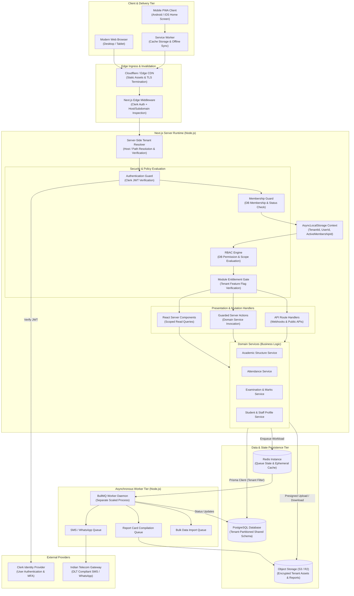

# Target SaaS System Architecture

## 1. High-Level Architectural Model

**Status**: TARGET / PROPOSED

The target architecture transforms the monolithic, single-tenant baseline into a resilient, multi-tenant educational SaaS platform. The application is structured into clearly delineated architectural tiers, enforcing separation between identity, tenancy, authorization, business logic, asynchronous workflows, and analytics.

```
                +-------------------------------------------------+
                |          Platform / SaaS Control Plane          |
                |  (Global Tenant Management, Billing, Metrics)   |
                +-------------------------------------------------+
                                         |
                                         v
                +-------------------------------------------------+
                |                  Tenant System                  |
                |   (Server-Side Resolution, Institutional Scope) |
                +-------------------------------------------------+
                                         |
                                         v
                +-------------------------------------------------+
                |             Tenant Membership Layer             |
                |  (User-Tenant Binding, Active Context Validation)|
                +-------------------------------------------------+
                                         |
                                         v
                +-------------------------------------------------+
                |                  DB RBAC Layer                  |
                |  (Roles, Permissions, Scopes, Policy Engine)    |
                +-------------------------------------------------+
                                         |
                                         v
                +-------------------------------------------------+
                |            Application Domain Layer             |
                | (Academic Structures, Profiles, Schedules, Exams|
                +-------------------------------------------------+
                                         |
                                         v
                +-------------------------------------------------+
                |            Module Entitlement Layer             |
                | (Subscription Plans, Feature Flags, Module Gates|
                +-------------------------------------------------+
                                         |
                                         v
                +-------------------------------------------------+
                |               Application Screens               |
                | (RSC Views, Mobile PWA, Guarded Action Modals)  |
                +-------------------------------------------------+
                                         |
                                         v
                +-------------------------------------------------+
                |           Workflows / Background Jobs           |
                | (BullMQ Workers, Redis Queues, Notifications)   |
                +-------------------------------------------------+
                                         |
                                         v
                +-------------------------------------------------+
                |              Reporting / Analytics              |
                | (Atomic Mutation Auditing, Report Cards, Export)|
                +-------------------------------------------------+
```

---

## 2. Layer Dependency & Contract Rules

1. **Control Plane -> Tenant System**: The SaaS Control Plane provisions and manages tenants; individual institutional tenants have zero visibility into other tenants or control plane administration.
2. **Tenant System -> Tenant Membership**: A tenant cannot be accessed without resolving an active institutional context and verifying the authenticated user's `TenantMembership`.
3. **Tenant Membership -> DB RBAC**: Membership establishes *which* tenant the user is acting within; RBAC defines *what* the user is authorized to perform within that tenant.
4. **DB RBAC -> Application Domain**: Domain operations (creating an exam, updating attendance) strictly evaluate the user's evaluated permissions and access scopes before invoking domain logic.
5. **Application Domain -> Module Entitlements**: Even if a user has permission to perform an action (e.g. `fee.create`), the action is blocked if the tenant's active subscription does not include that module entitlement.
6. **Application Screens -> Workflows**: Screens dispatch synchronous requests through guarded Server Actions or Route Handlers; long-running operations (PDF compiling, mass SMS) are offloaded to background queues.
7. **Workflows -> Reporting / Analytics**: Critical mutation audits are committed atomically in the database; background workers process secondary event streams, aggregation tables, and export caches.

---

## 3. Comprehensive Target Architecture Diagram



---

## 4. Architectural State Transition Summary

| Concern | CURRENT / VERIFIED Baseline | TARGET / PROPOSED Architecture | Architectural Decision Status |
| :--- | :--- | :--- | :---: |
| **Hosting Model** | Local developer container / single VPS. | Horizontally scalable containerized Next.js runners with separate worker daemons. | TARGET / PROPOSED |
| **Data Partitioning** | 0 multi-tenancy; flat global schema. | Shared PostgreSQL database with logical tenant scoping (`tenantId` on all domain entities). | DECISION |
| **Authentication Flow** | Clerk metadata controls routing in middleware. | Edge middleware verifies Clerk JWT; server-side resolver loads DB membership and RBAC permissions into execution context. | DECISION |
| **Asynchronous Engine**| None; synchronous server actions. | BullMQ + Redis queue architecture with durable retry mechanisms and worker autoscaling. | DECISION |
| **Asset Storage** | Unsigned client-side Cloudinary preset. | Secure S3-compatible private bucket with presigned URLs and tenant directory isolation. | DECISION |
