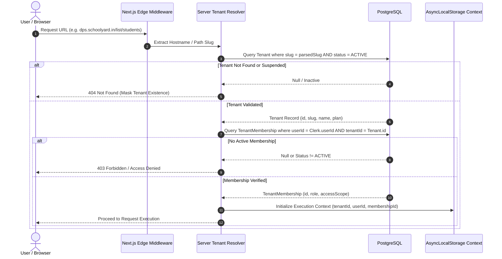

# Multi-Tenancy Architecture & Isolation Specification

## 1. Architectural Strategy: Shared Database / Shared Schema

**Status**: DECISION (Conceptual Model)

The target data architecture adopts a **Shared Database / Shared Schema** multi-tenant model. All institutional tenants reside within a single PostgreSQL database instance and share a unified relational schema. 

Every tenant-owned table is partitioned logically via a non-nullable foreign key: `tenantId: String` (or UUID/CUID), pointing to the authoritative `Tenant` record.

### Why Shared Database / Shared Schema?
1. **Operational Simplicity**: Avoids the extreme operational complexity of running thousands of separate PostgreSQL schema migrations or micro-databases.
2. **Resource Efficiency**: Optimizes database connection pools (via PgBouncer) and memory utilization across thousands of small-to-medium educational institutions.
3. **Cross-Tenant Analytics & Benchmarking**: Permits aggregated, anonymized educational benchmarking and unified platform administration without complex federation.

---

## 2. Server-Side Tenant Resolution & Verification

**Status**: TARGET / PROPOSED

Tenant context must **never** be accepted directly from untrusted client-controlled inputs (such as arbitrary request bodies or unverified headers like `x-tenant-id`). Tenant identity must be resolved and verified server-side on every request.



### Open Architectural Decision: Tenant Routing Strategy
**Status**: OPEN / TBD (Step 1 Decision)
- **Option A (Subdomain Routing)**: `https://[tenant-slug].schoolyard.in/dashboard`
  - *Pros*: Natural institutional branding, clear cookie boundaries, clean aesthetics.
  - *Cons*: Requires wildcard DNS (`*.schoolyard.in`), wildcard SSL certificates, and custom domain CNAME verification.
- **Option B (Path-Based Routing)**: `https://schoolyard.in/:tenantSlug/dashboard`
  - *Pros*: Simple DNS, single SSL certificate, works easily on standard static hosts.
  - *Cons*: Messy URLs, routing parameter overhead on every Next.js page.
- **Decision Deferred**: The core multi-tenancy layer must abstract tenant extraction behind a `resolveTenantFromRequest(req)` interface so routing topology can be adjusted without rewriting business logic.

---

## 3. Tenant Isolation Mechanism: Application-Level vs. PostgreSQL RLS

**Status**: OPEN / TBD (Step 3 Database Architecture Decision)

To prevent cross-tenant data leakage, the data access layer must guarantee that no query can execute without scoping to the active `tenantId`.

| Isolation Approach | Mechanics | Trade-Offs | Evaluation Status |
| :--- | :--- | :--- | :---: |
| **Option 1: Prisma Client Extension (Application-Level)** | Use Prisma `$extends` query middleware to automatically append `where: { tenantId }` to every `findMany`, `findFirst`, `update`, `delete`, and inject `data: { tenantId }` on `create`. | Clean Node.js integration; zero connection pool overhead; works seamlessly with transaction pools. Vulnerable to raw SQL bypass if unguarded. | RECOMMENDED BASELINE |
| **Option 2: PostgreSQL Row-Level Security (RLS)** | Define native PostgreSQL `ENABLE ROW LEVEL SECURITY` policies on all tables, setting session variables (`SET LOCAL app.current_tenant_id = '...'`). | Defense-in-depth at DB engine level; protects against raw SQL flaws. Adds latency on connection checkout; requires transaction wrappers around every read. | EVALUATION IN STEP 3 |
| **Option 3: Hybrid Isolation** | Application-level Prisma extensions for standard queries + RLS for high-consequence compliance tables (e.g. fees, exam grades). | Best security posture; slightly higher architectural maintenance. | EVALUATION IN STEP 3 |

---

## 4. Cross-Tenant Access Prevention Rules

1. **Mandatory Tenant Scoping in Queries**: Every database read and write MUST include `where: { tenantId: activeTenantId }`.
2. **Foreign Key Tenant Consistency**: When associating related entities (e.g., assigning a `Student` to a `Class`), both the `Student` and the `Class` MUST share the exact same `tenantId`. A cross-tenant foreign key assignment must be rejected by foreign key or trigger constraints.
3. **Composite Unique Constraints**: In a single-tenant database, `Class.name` or `Subject.name` can be `@unique`. In a multi-tenant database, this collides immediately. All unique constraints must be converted to composite keys scoped to `tenantId`:
   ```prisma
   // TARGET / PROPOSED
   model Class {
     id       String @id @default(cuid())
     tenantId String
     name     String
     // ...
     @@unique([tenantId, name])
     @@index([tenantId])
   }
   ```
4. **Index Strategy**: Every multi-tenant table MUST possess an index on `tenantId` (or a composite index beginning with `tenantId`, e.g., `@@index([tenantId, createdAt])`) to prevent sequential table scans as total platform data grows.

---

## 5. Cross-Cutting Tenant Awareness

1. **Tenant-Aware Auditing**: Every entry in the `AuditLog` table records the `tenantId` alongside the actor's `userId`. Multi-tenant queries allow institutional admins to inspect only their school's audit records.
2. **Tenant-Aware Caching**: Redis cache keys MUST always be prefixed with the tenant ID: `cache:tenant:${tenantId}:classes`.
3. **Tenant-Aware Background Jobs**: Background job payloads in BullMQ must always serialize the `tenantId`. When workers process jobs, they must re-initialize the tenant context to ensure data isolation.
4. **Tenant-Aware File Storage**: Object storage paths must be hierarchically partitioned by tenant ID: `/tenants/${tenantId}/students/${studentId}/photo.webp`.
