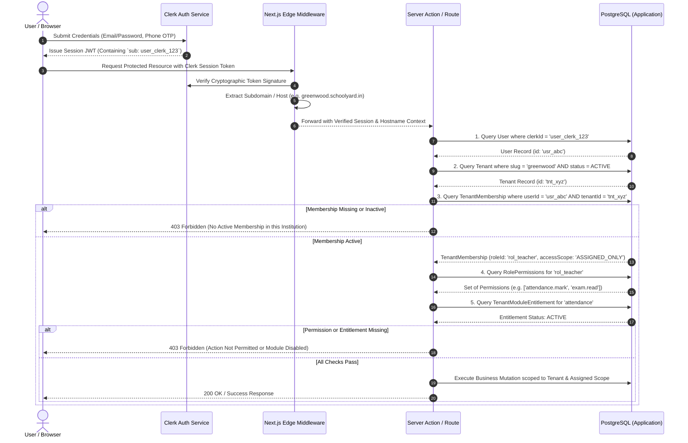

# Identity, Authentication & Authorization Architecture

## 1. Core Architectural Principle: Decoupling AuthN from AuthZ

**Status**: DECISION

A foundational principle of this platform is the strict separation of **Authentication (Identity)** from **Authorization (Access Control & Business Governance)**.

- **Authentication ("Who are you?")**: Managed externally by **Clerk**. Clerk verifies credentials, issues cryptographic session JWTs, handles multi-factor authentication (MFA), social logins, and password resets.
- **Tenant Access ("Which institution are you acting within?")**: Managed by the application's PostgreSQL database via **`TenantMembership`** records binding a `User` to a specific `Tenant`.
- **Authorization ("What are you allowed to do?")**: Managed entirely by the application's PostgreSQL database via dynamic **`Role`**, **`Permission`**, and **`AccessScope`** definitions.
- **Module Entitlement ("Is this capability enabled for this institution?")**: Managed by the application's PostgreSQL database via institutional **`ModuleEntitlement`** licenses.

```
                              [ Human Being ]
                                     |
                       [ 1. AUTHENTICATION (Clerk) ]
                       - Verifies password / OTP / MFA
                       - Issues Session JWT with `sub` (userId)
                                     |
                                     v
                       [ 2. IDENTITY MAPPING (PostgreSQL) ]
                       - Maps Clerk `sub` to application `User`
                                     |
                                     v
                       [ 3. TENANT RESOLUTION & MEMBERSHIP ]
                       - Resolves institution via Subdomain / Path
                       - Verifies active `TenantMembership` record
                                     |
                                     v
                       [ 4. AUTHORIZATION (DB RBAC) ]
                       - Resolves `Role` & assigned `Permissions`
                       - Evaluates `AccessScope` (All vs. Assigned)
                                     |
                                     v
                       [ 5. MODULE ENTITLEMENT ]
                       - Confirms Tenant subscription enables module
                                     |
                                     v
                          [ Execution Permitted ]
```

---

## 2. Authentication & Authorization Flow Diagram



---

## 3. Conceptual Identity Domain Model

**Status**: TARGET / PROPOSED (Physical schema deferred to Step 3)

The conceptual model maintains a clean distinction between the person, their institutional relationships, and their specialized academic profiles:

```
+-------------------------------------------------------------------------+
|                                  USER                                   |
| - id: String (Primary Key)                                              |
| - clerkId: String (Unique, Indexed, maps to Clerk sub)                  |
| - email: String (Unique)                                                |
| - phone: String? (Unique)                                               |
| - firstName, lastName: String                                           |
| - status: UserStatus (ACTIVE, SUSPENDED, PENDING)                       |
+-------------------------------------------------------------------------+
                                     |
                                     | 1-to-Many
                                     v
+-------------------------------------------------------------------------+
|                            TENANT MEMBERSHIP                            |
| - id: String (Primary Key)                                              |
| - tenantId: String (Foreign Key -> Tenant)                              |
| - userId: String (Foreign Key -> User)                                  |
| - roleId: String (Foreign Key -> Role)                                  |
| - accessScope: AccessScope (INSTITUTION_WIDE, ASSIGNED_ONLY, SELF_ONLY) |
| - status: MembershipStatus (ACTIVE, INVITED, ARCHIVED)                  |
| - joinedAt: DateTime                                                    |
+-------------------------------------------------------------------------+
                                     |
                                     +-------------------+
                                     | 1-to-1            | 1-to-1
                                     v                   v
+------------------------------------+  +---------------------------------+
|           STUDENT PROFILE          |  |          STAFF PROFILE          |
| - id: String                       |  | - id: String                    |
| - membershipId: String (FK)        |  | - membershipId: String (FK)     |
| - admissionNumber: String          |  | - employeeCode: String          |
| - currentClassId: String (FK)      |  | - designation: String           |
| - parentId: String (FK)            |  | - department: String            |
+------------------------------------+  +---------------------------------+
```

---

## 4. User Provisioning Lifecycle

**Status**: OPEN / TBD (Step 1 Architecture Decision)

Provisioning users across both an external identity provider (Clerk) and an internal relational database requires guaranteed transactional safety. 

### Evaluated Provisioning Strategies:

| Strategy | Mechanics | Trade-Offs | Evaluation Status |
| :--- | :--- | :--- | :---: |
| **Strategy A: Webhook-First Sync** | Admin creates Clerk invitation via Clerk API/Dashboard. When user accepts, Clerk dispatches `user.created` webhook. Next.js Route Handler creates PostgreSQL `User` and binds pending `TenantMembership`. | Loose coupling; Clerk manages invitation emails; resilient against downtime. Asynchronous delay between invite acceptance and database record creation. | RECOMMENDED FOR EVALUATION |
| **Strategy B: DB-Outbox-First Sync** | Admin creates pending `User` and `TenantMembership` in PostgreSQL first within a transaction. An outbox job worker asynchronously calls Clerk Backend API to invite user and records `clerkId`. | Strict transactional consistency in application DB; complete control over invitation email templates. Requires resilient background worker and retry mechanisms. | ALTERNATIVE CANDIDATE |

### Mandatory Provisioning Requirements:
1. **Idempotency**: Webhook consumers and API handlers must use idempotency keys (e.g. Clerk Event ID) to prevent duplicate user creation.
2. **Reconciliation Worker**: A scheduled background job must reconcile orphaned Clerk users with missing PostgreSQL memberships and vice-versa.
3. **Graceful Failure**: If database persistence fails, pending invitations must remain uncommitted or rollback cleanly.
