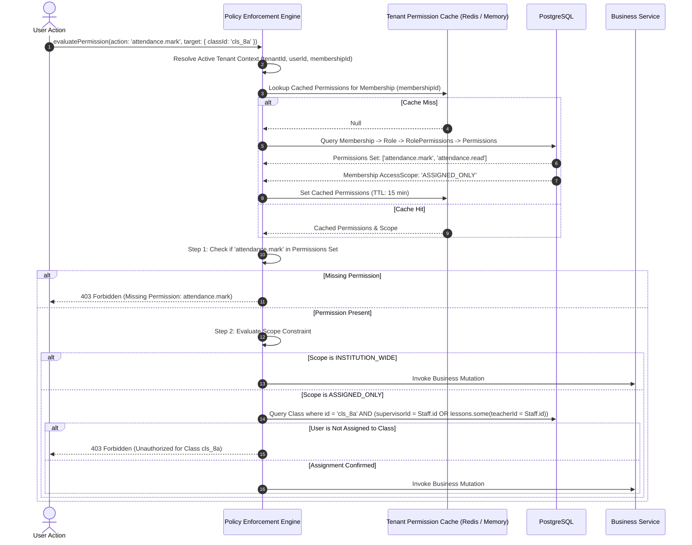

# Role-Based Access Control (RBAC) & Permission Model

## 1. Architectural Foundation: Dynamic Database-Driven RBAC

**Status**: DECISION

The platform strictly rejects hardcoding authorization roles inside identity tokens (such as Clerk's `publicMetadata.role`) or application source code. Instead, authorization is governed by a **Dynamic Database-Driven RBAC** engine residing entirely within the application's PostgreSQL database.

### Key Architectural Tenets:
1. **Permissions are Atomic Strings**: Authorization checks evaluate fine-grained capability strings (e.g. `attendance.mark`, `exam.publish`), never coarse-grained role names.
2. **Roles are Named Collections of Permissions**: A `Role` (e.g., `Class Teacher`, `Principal`, `Accountant`) is an institutional grouping of atomic permissions.
3. **Institutional Customizability**: While the platform provides standardized system roles, institutional administrators may adjust permission assignments per role to match their organizational structure.
4. **Scope-Aware Enforcement**: Permissions are evaluated in conjunction with an **`AccessScope`** that restricts the query boundary (e.g., a teacher with `attendance.mark` can only mark attendance for classes assigned to them).
5. **UI Visibility is Only a Convenience**: Hiding a button in the UI is a user experience consideration, never a security boundary. All authorization policies are enforced server-side inside Server Actions and Data Services.

---

## 2. Standardized Granular Permission Catalog

**Status**: TARGET / PROPOSED

Permissions follow the standard dot-notation hierarchy: `[domain].[entity].[action]`.

### Academic & Student Permissions
- `student.profile.read`: View student personal records, family links, and academic history.
- `student.profile.write`: Create, edit, or archive student profiles.
- `student.attendance.read`: View attendance records and summary percentages for students.
- `student.attendance.write`: Modify historical attendance records (administrative correction).

### Faculty & Staff Permissions
- `teacher.profile.read`: View teacher directory and subject allocations.
- `teacher.profile.write`: Onboard, edit, or terminate staff profiles.
- `teacher.assignment.write`: Assign teachers as supervisors or subject instructors to classes.

### Academic Structure Permissions
- `class.read`: View class sections, capacities, and enrolled rosters.
- `class.write`: Create, edit, or decommission classes and sections.
- `subject.read`: View subject definitions and syllabus codes.
- `subject.write`: Create and modify curriculum subjects.
- `timetable.read`: View weekly period schedules.
- `timetable.write`: Construct or modify section timetables and teacher allocations.

### Assessment & Grading Permissions
- `exam.read`: View upcoming and historical examination schedules.
- `exam.create`: Configure new examination periods and attach subjects.
- `exam.update`: Adjust exam dates, weightages, or maximum scores.
- `exam.publish`: Officially release examination results to students and parents.
- `result.read`: View entered marks and class averages.
- `result.write`: Enter or edit raw assessment marks for students.
- `result.publish`: Approve and lock marks for official report card compilation.

### Attendance Permissions
- `attendance.read`: View daily class and subject attendance summaries.
- `attendance.mark`: Take daily morning roll-call or period attendance.
- `attendance.correct`: Override or correct previously locked attendance entries with audit reason.

### Financial Operations Permissions (V2 Roadmap)
- `fee.structure.read`: View tuition fee components, schedules, and discount policies.
- `fee.structure.write`: Define or modify institutional fee tiers.
- `fee.collect`: Record offline cash/cheque payments and issue receipts.
- `fee.waiver.approve`: Authorize fee concessions, scholarships, or late fine waivers.

---

## 3. Access Scopes

**Status**: TARGET / PROPOSED

Permissions alone do not define the horizontal boundary of an operation. The system couples permissions with an **`AccessScope`**:

| Access Scope | Definition & Query Boundary | Typical Persona Assignment |
| :--- | :--- | :--- |
| **`PlatformScope.GLOBAL`** | Cross-tenant administrative access to platform control plane. | SaaS Super Admin |
| **`TenantScope.INSTITUTION_WIDE`** | Unrestricted access to all data records belonging to the active `tenantId`. | Principal, School Director, Super Admin |
| **`TenantScope.OPERATIONAL_DOMAINS`**| Access restricted to specific functional domains (e.g. accounting, admissions). | School Accountant, Front-Desk Clerk |
| **`TenantScope.ASSIGNED_ONLY`** | Access restricted to entities explicitly linked to the user's staff record (assigned classes, subjects, or supervisor roles). | Subject Teacher, Class Teacher |
| **`TenantScope.LINKED_CHILDREN`** | Access strictly restricted to student profiles linked via parent-child relationship records. | Parent / Legal Guardian |
| **`TenantScope.SELF_ONLY`** | Access strictly restricted to the user's personal student or staff record. | Student, Individual Staff Member |

---

## 4. RBAC Evaluation Flow Diagram



---

## 5. Server-Side Enforcement Rules

1. **Server Action & Route Guard Wrapper**: Every Server Action must be wrapped in a standardized policy guard:
   ```typescript
   // TARGET / PROPOSED
   export const submitAttendance = createGuardedAction({
     permission: 'attendance.mark',
     scopeValidator: async (ctx, input) => {
       return await verifyTeacherClassAssignment(ctx.tenantId, ctx.userId, input.classId);
     },
     handler: async (ctx, input) => {
       return await attendanceService.recordAttendance(ctx.tenantId, input);
     },
   });
   ```
2. **Zero Client Trust**: The frontend UI queries user permissions solely to conditionally render buttons, navigation links, and edit actions. If a client bypasses the UI and posts directly to the endpoint, the server-side guard executes full policy evaluation.
