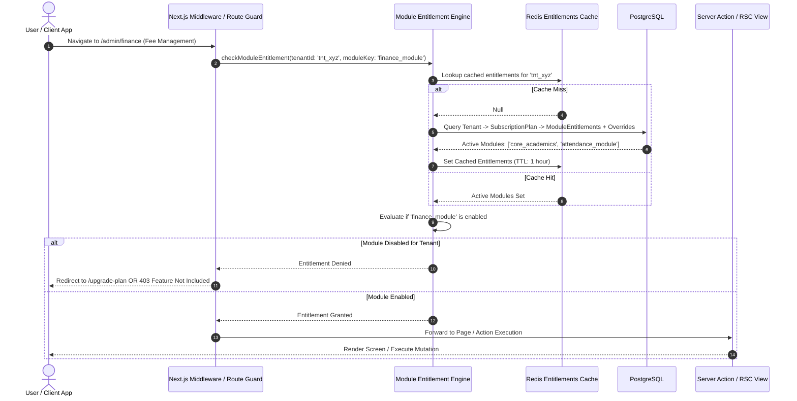

# Module Entitlement & Feature Licensing Architecture

## 1. Architectural Distinction: RBAC vs. Module Entitlements

**Status**: DECISION

A critical architectural requirement is the strict operational separation between **User Authorization (RBAC)** and **Institutional Licensing (Module Entitlements)**.

| Architectural Dimension | RBAC (Role-Based Access Control) | Module Entitlement (Feature Licensing) |
| :--- | :--- | :--- |
| **Core Question** | *"Can this specific user perform this action?"* | *"Has this institution paid for or enabled this capability?"* |
| **Evaluation Scope** | Bound to the **User** within their `TenantMembership`. | Bound to the **Tenant** via their subscription plan and feature flags. |
| **Failure Response** | `403 Forbidden` (Unauthorized user). | `402 Payment Required` or `403 Feature Disabled` (Institutional plan upgrade required). |
| **Example Evaluation**| User has `fee.collect` permission. | Tenant has `finance_module` enabled in active subscription. |

**The Dual-Gate Rule**: An operation is permitted if and only if **BOTH** gates evaluate to `ALLOW`. If an administrator assigns `fee.collect` to an accountant, but the school is on the "Basic Academic" tier without the finance module, any attempt to access fee screens or invoke fee actions is immediately blocked.

---

## 2. Standardized Module Key Catalog

**Status**: TARGET / PROPOSED

```
+-------------------------------------------------------------------------+
|                       STANDARDIZED MODULE KEYS                          |
+-------------------------------------------------------------------------+
| - `core_academics`     : Classes, Sections, Subjects, Basic Timetable    |
| - `student_directory`  : Student Profiles, Enrolment, Parent Directory   |
| - `staff_directory`    : Faculty Directory, Department Allocations      |
| - `attendance_module`  : Daily & Subject Attendance Logging              |
| - `examination_module` : Exam Scheduling, Marks Entry, Gradebooks        |
| - `communications`     : School Notices, Bulletin, Push Alerts          |
| - `notification_sms`   : Transactional SMS & WhatsApp Integration (Addon)|
| - `finance_module`     : Fee Structures, Invoicing, Payment Collection   |
| - `admissions_portal`  : Online Public Applications & Document Uploads   |
| - `transport_module`   : Bus Routes, Stops, Fleet Tracking               |
| - `advanced_reports`   : Custom PDF Report Card Designer, Analytics      |
+-------------------------------------------------------------------------+
```

---

## 3. Subscription Tiers & Tenant Overrides

**Status**: TARGET / PROPOSED (Commercial pricing marked TBD)

```
                                  [ Subscription Plan ]
                             (e.g. Standard Academic Tier)
                                          |
                                          | Defines Baseline Modules
                                          v
                              [ Active Tenant Entitlements ]
                                          +
                               [ Tenant Custom Overrides ]
                        (e.g. Early Beta Access, Add-on SMS Package)
                                          |
                                          v
                           [ Evaluated Effective Entitlements ]
```

### Entitlement Inheritance Rules:
1. **Plan Baseline**: When an institution subscribes to a plan (e.g. "Standard Academic"), the tenant inherits all default module keys associated with that tier.
2. **Tenant-Specific Overrides**: Platform administrators can grant custom overrides to specific institutions (e.g., enabling `admissions_portal` as a promotional trial, or disabling `notification_sms` due to compliance review). Overrides always take precedence over plan defaults.
3. **Grace Periods & Suspension**: If an institution fails subscription renewal, their status transitions to `GRACE_PERIOD` (read-only access enabled for 14 days) before advancing to `SUSPENDED` (all tenant operations blocked).

---

## 4. Module Entitlement Flow Diagram



---

## 5. Multi-Layered Entitlement Enforcement

1. **Navigation & UI Shell**: The sidebar navigation menu (`Menu.tsx`) filters menu items by checking the tenant's evaluated module entitlements before rendering links, preventing clutter from unpurchased modules.
2. **Route Gating (RSC Pages)**: Every page in an optional module (e.g. `/list/finance/page.tsx`) invokes an entitlement assertion at the top of the Server Component. If disabled, it calls `redirect('/unauthorized-feature')`.
3. **Server Action Gating**: Every mutation action validates that the target module is licensed. This prevents API abuse where a malicious client executes `createFeeStructure()` even if the UI link is hidden.
