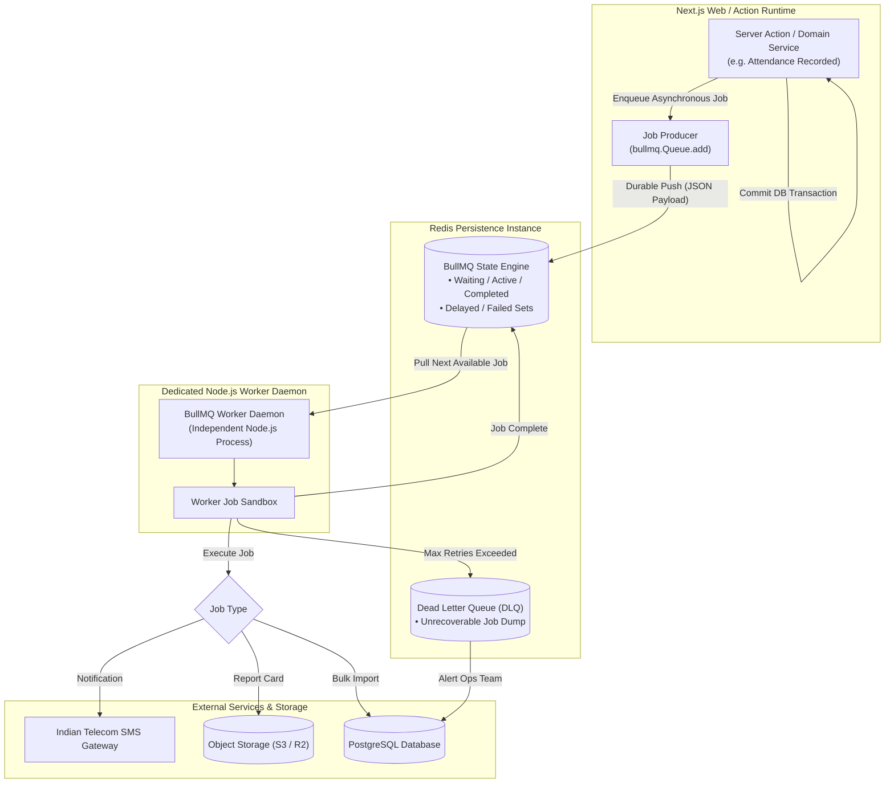

# Background Processing & Asynchronous Worker Architecture

## 1. Architectural Strategy: Distributed Queues via BullMQ & Redis

**Status**: DECISION

To maintain snappy sub-second UI responsiveness, all operations requiring external network requests (SMS, WhatsApp, emails), heavy CPU rendering (PDF compilation, timetable auto-solvers), or bulk database inserts (CSV onboarding) are strictly decoupled from the synchronous Next.js request cycle.

The platform utilizes **BullMQ** backed by **Redis** as its durable, distributed asynchronous processing engine.

---

## 2. Dedicated Queue Topology

**Status**: TARGET / PROPOSED

The system defines four isolated, specialized queues to guarantee that high-volume operations (e.g. bulk notifications) do not starve critical transactional jobs:

| Queue Identifier | Priority | Typical Workloads | Concurrency / Worker Rules |
| :--- | :---: | :--- | :--- |
| **`queue:notifications`** | High | Transactional SMS, absentee alerts, OTP dispatches, parent push alerts. | High concurrency (15-25 workers); rate-limited against telecom gateway quotas. |
| **`queue:reports`** | Medium | Term report card compilation, mark sheet PDF generation, class roster exports. | CPU-intensive (2-4 workers); sandboxed Chromium or PDF rendering process. |
| **`queue:imports`** | Low | Bulk student CSV onboarding, historic attendance uploads, ledger imports. | Low concurrency (1-2 workers); chunked transactions with progress heartbeat. |
| **`queue:system`** | High | Clerk user sync reconciliation, daily archival cleanup, telemetry aggregation. | Scheduled cron worker; strictly idempotent execution. |

---

## 3. Background Job Flow Diagram

---

## 4. Reliability, Idempotency & Failure Recovery Rules

1. **Mandatory Job Idempotency**:
   - Every background job MUST be designed so that executing it multiple times produces the exact same outcome without duplicate side-effects.
   - Example: A notification job checks if an `AuditLog` or `NotificationRecord` already exists with the matching `jobId` before firing the telecom API.
2. **Exponential Backoff & Retries**:
   - External network calls use exponential backoff: 3 retries with initial delay of 5 seconds (`attempts: 3, backoff: { type: 'exponential', delay: 5000 }`).
3. **Dead-Letter Queue (DLQ)**:
   - If a job fails after all configured retries, it moves to the Failed state. An alert is logged, and administrators can trigger a manual replay from the SaaS Control Plane.
4. **Independent Worker Process**:
   - BullMQ workers run in a dedicated, standalone Node.js process (separate Docker container or systemd service) so that heavy CPU or memory usage in PDF generation never degrades web server responsiveness.
