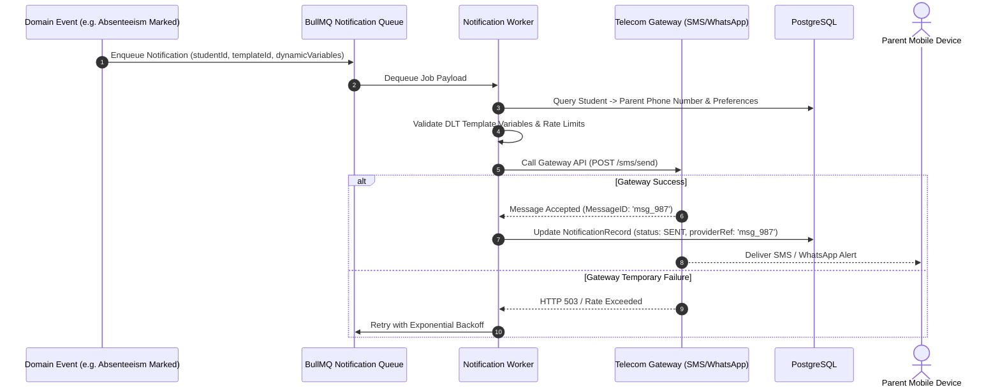

# Multi-Channel Notification Architecture

## 1. Architectural Overview & Objectives

**Status**: TARGET / PROPOSED

Parental and staff communication is a cornerstone of educational institutional software. The platform architecture provides an asynchronous, multi-channel notification dispatch engine supporting **Transactional SMS**, **WhatsApp Messaging**, **In-App / Web Push**, and **Email**.

---

## 2. Channel Prioritization & Indian Regulatory Compliance (DLT)

**Status**: TARGET / PROPOSED (Provider selection marked OPEN / TBD)

In the Indian educational context, commercial and transactional SMS messages are strictly governed by Telecom Regulatory Authority of India (TRAI) regulations via **Distributed Ledger Technology (DLT)**:

1. **DLT Entity & Template Pre-Registration**:
   - Every SMS sent over Indian networks must use an approved **Sender ID** (e.g. `SCHYRD`) and an approved **DLT Template ID**.
   - Messages must match registered template formats exactly (e.g., *"Dear Parent, your ward {#var#} was marked absent today on {#var#}. Schoolyard"*).
2. **Channel Selection Matrix**:

| Priority Level | Message Type | Preferred Channel | Fallback Channel | Regulatory Requirement |
| :---: | :--- | :--- | :--- | :--- |
| **Urgent (P0)** | Student Absenteeism, Emergency School Closure | Transactional SMS | WhatsApp Alert | DLT Implicit / Explicit Consent; 24/7 delivery allowed. |
| **Operational (P1)**| Homework Deadlines, Exam Timetable Released | WhatsApp / Web Push | In-App Notification | DLT Service Implicit; Promotional window rules apply. |
| **Financial (P1)**| Fee Due Reminder, Digital Payment Receipt | WhatsApp / SMS | Email | Transactional template with dynamic amount & date variables. |
| **General (P2)** | Monthly School Newsletter, Event Announcement| In-App Bulletin | Email | Batch queued; non-blocking delivery. |

---

## 3. Notification Dispatch Pipeline

---

## 4. User Notification Preferences & Tenant Quotas

1. **Notification Preferences**: Parents can toggle non-critical alerts (e.g. opting out of marketing emails or selecting WhatsApp instead of SMS for routine homework notices). Urgent safety and absence alerts cannot be opted out of.
2. **Institutional SMS Quotas**: Because SMS carries carrier costs in India, each institution has a monthly SMS quota defined in their `TenantModule` / Subscription record. If the quota is exhausted, routine alerts fall back to In-App / Push notifications unless additional credits are purchased.
