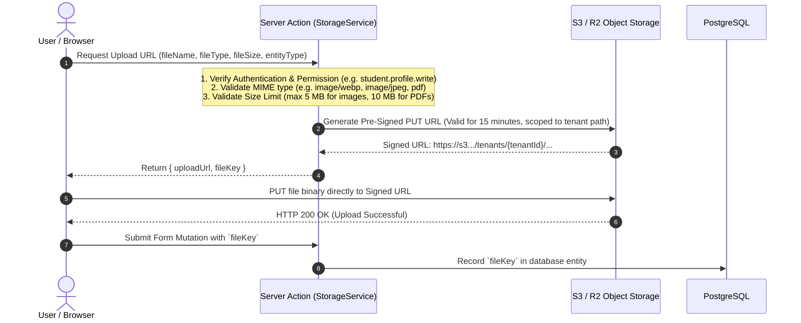

# File & Document Storage Architecture

## 1. Baseline Audit & Migration Driver

**Status**: CURRENT / VERIFIED vs. TARGET / PROPOSED

- **Current Baseline**: Sourced directly from `10-integrations.md` and `11-security-audit.md`. File uploads rely on `next-cloudinary` with an unsigned client-side upload preset (`uploadPreset="school"`). Any client can upload arbitrary files directly to Cloudinary without authentication or size verification. No support exists for private student documents, transfer certificates, or compiled PDF report cards.
- **Target Architecture**: Replace unvetted third-party client uploads with an **S3-Compatible Private Object Store** backed by **Pre-Signed Upload & Download Pipelines** and strict tenant-partitioned access.

---

## 2. Storage Provider Abstraction & Directory Topology

**Status**: DECISION (Storage Abstraction); OPEN / TBD (Exact Provider Selection: AWS S3 vs. Cloudflare R2 vs. MinIO)

All file interactions are encapsulated behind a unified `StorageService` interface, isolating application code from the specific underlying cloud vendor.

### Hierarchical Tenant Directory Layout:
```
s3://institution-vault-production/
  └── tenants/
      └── {tenantId}/
          ├── public/
          │   ├── school-crest.webp
          │   └── campus-hero.webp
          ├── profiles/
          │   ├── staff/{staffId}/avatar.webp
          │   └── students/{studentId}/photo.webp
          ├── documents/ (STRICTLY PRIVATE)
          │   ├── students/{studentId}/
          │   │   ├── birth-certificate.pdf
          │   │   └── previous-marksheet.pdf
          └── generated-reports/ (STRICTLY PRIVATE)
              └── academic-year-{yearId}/
                  └── term-{termId}/
                      └── class-{classId}-report-cards.zip
```

---

## 3. Secure Pre-Signed Upload Pipeline

Client components never receive permanent cloud credentials or access secret keys. All uploads follow a verified pre-signed URL workflow:



---

## 4. Secure Pre-Signed Download Pipeline for Confidential Records

Educational records (student medical data, transfer certificates, grade cards) must **never** be publicly accessible via static public URLs.

1. **Private Bucket by Default**: All institutional document paths are marked private with zero public read access.
2. **On-Demand Pre-Signed GET URLs**: When an authorized parent or teacher views a report card or document, the server generates a time-limited pre-signed download URL with an expiration window of 15 minutes (`expiresIn: 900`).
3. **MIME Type Sniffing Prevention**: S3 response headers enforce `Content-Disposition: attachment` and `X-Content-Type-Options: nosniff` to protect client browsers from executing malicious uploaded HTML or scripts.
