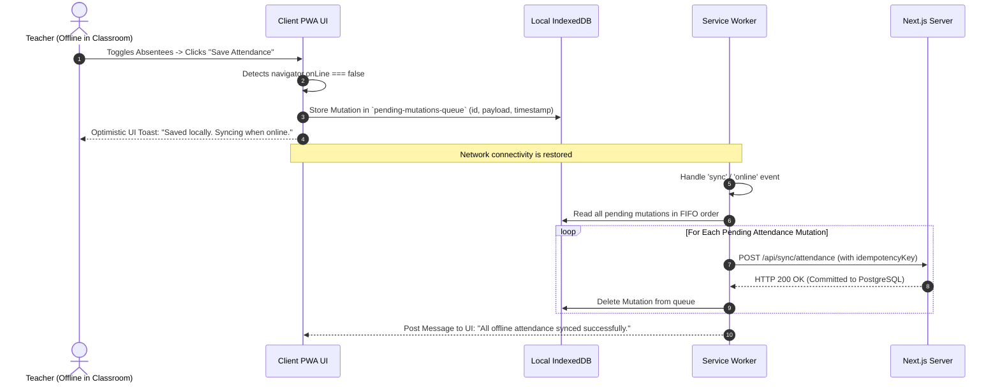

# Progressive Web Application (PWA) Architecture

## 1. Baseline State vs. Target Architecture

**Status**: CURRENT / VERIFIED vs. TARGET / PROPOSED

- **Current Baseline Fact**: Sourced from `09-pwa-client-architecture.md`. PWA capability in the repository is **0% implemented**. There is no `manifest.webmanifest`, no service worker, no offline asset caching, and no mobile install banners.
- **Target Architecture**: Transform the client into a high-performance, mobile-first PWA powered by modern service workers (`@serwist/next`), providing installability, offline timetable viewing, and resilient background synchronization.

---

## 2. Web App Manifest Specification

**Status**: TARGET / PROPOSED

```json
{
  "name": "Schoolyard Institutional Portal",
  "short_name": "Schoolyard",
  "description": "Multi-Tenant Educational Institution Operating System",
  "start_url": "/",
  "display": "standalone",
  "background_color": "#F7F8FA",
  "theme_color": "#C3EBFA",
  "orientation": "portrait-primary",
  "icons": [
    { "src": "/icons/icon-192x192.png", "sizes": "192x192", "type": "image/png" },
    { "src": "/icons/icon-512x512.png", "sizes": "512x512", "type": "image/png" },
    { "src": "/icons/icon-maskable-512x512.png", "sizes": "512x512", "type": "image/png", "purpose": "maskable" }
  ]
}
```

---

## 3. Caching & Offline Strategy Matrix

**Status**: TARGET / PROPOSED

```
                         [ Client Browser Request ]
                                     |
                                     v
                           [ Service Worker Cache ]
                                     |
              +----------------------+----------------------+
              |                                             |
     [ Static Asset Request ]                      [ Dynamic API Request ]
     - JS, CSS, Fonts, Icons                       - Attendance, Marks, Profile
              |                                             |
              v                                             v
     { Cache-First Strategy }                     { Network-First Strategy }
     - Serve immediately from                      - Fetch fresh data from network
       CacheStorage                                - If offline: Fallback to
     - Background update if stale                    IndexedDB cached snapshot
```

| Asset / Route Category | Strategy | Storage Engine | Invalidation / Revalidation Policy |
| :--- | :--- | :--- | :--- |
| **Static Assets** (JS, CSS, SVGs, Fonts) | **Cache-First** | CacheStorage (`v1-assets`) | Immutable hash versioning; cleared automatically on new service worker activation. |
| **Timetable & Weekly Schedule** | **Stale-While-Revalidate** | CacheStorage (`v1-schedule`) | Returns cached schedule instantly; background revalidation updates UI if schedule changes. |
| **Student Roster & Class Lists** | **Network-First (with IndexedDB fallback)** | IndexedDB (`schoolyard-rosters`) | Fetches active roster; saves snapshot locally for offline roll-call capability. |
| **Mutations** (Attendance, Marks, Notes) | **Network-Only (with Background Sync Queue)** | IndexedDB (`pending-mutations-queue`) | If offline, saves serialized mutation payload; service worker dispatches `sync` event upon reconnection. |

---

## 4. Offline Attendance Marking & Background Synchronization


