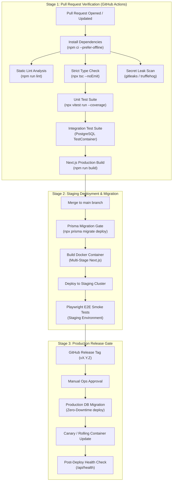

# Continuous Integration & Continuous Delivery (CI/CD) Architecture

## 1. Baseline Audit & Pipeline Vision

**Status**: CURRENT / VERIFIED vs. TARGET / PROPOSED

- **Current Baseline Fact**: Sourced from `13-cicd-deployment-audit.md`. The repository has **0 CI/CD workflows** (no `.github/workflows` directory). The `Dockerfile` incorrectly executes `RUN npx prisma migrate dev --name init` during image build, which breaks in containerized CI environments.
- **Target Architecture**: Implement a robust GitHub Actions CI/CD pipeline that validates every pull request, runs automated tests, validates Prisma database migrations, and orchestrates zero-downtime containerized deployments.

---

## 2. CI/CD Pipeline Lifecycle Diagram

---

## 3. Branch Protection & Release Gates

1. **`main` Branch Protection Rules**:
   - Direct pushes to `main` are strictly prohibited.
   - Merging requires at least one approving peer review.
   - All status checks (Lint, Typecheck, Unit Tests, Integration Tests, Build) MUST pass before the "Merge" button is enabled.
2. **Deterministic Database Migration Gate**:
   - Migrations are never run during Docker image builds.
   - Migrations execute during the deployment release phase via `npx prisma migrate deploy`. If a migration script fails, the release halts immediately before new application containers are deployed.
3. **Rollback Strategy**:
   - Application containers support instant rollback to the previous immutable Docker image tag.
   - Database migrations must be designed to be backward compatible (expand-and-contract pattern) so that rolling back the web application does not break the database state.
