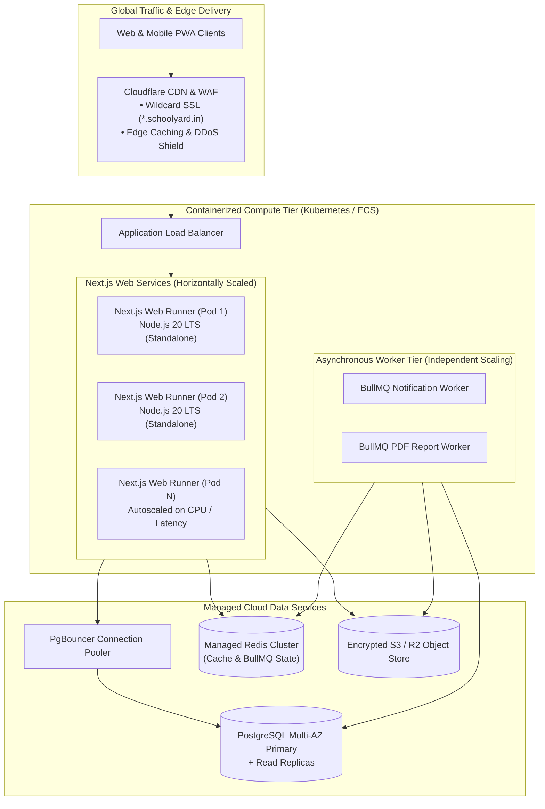

# Deployment Strategy & Containerization Architecture

## 1. High-Level Deployment Architecture Diagram



---

## 2. Multi-Stage Production Dockerfile Specification

**Status**: TARGET / PROPOSED

Step 0 identified that the current `Dockerfile` is a defective single-stage build running `prisma migrate dev` at image build time. The target Dockerfile uses Next.js standalone multi-stage compilation:

```dockerfile
# Stage 1: Dependency resolution
FROM node:20-alpine AS deps
WORKDIR /app
COPY package*.json ./
RUN npm ci --prefer-offline

# Stage 2: Application compilation
FROM node:20-alpine AS builder
WORKDIR /app
COPY --from=deps /app/node_modules ./node_modules
COPY . .
ENV NEXT_TELEMETRY_DISABLED=1
ENV NODE_ENV=production
RUN npx prisma generate
RUN npm run build

# Stage 3: Minimal production runner
FROM node:20-alpine AS runner
WORKDIR /app
ENV NODE_ENV=production
ENV PORT=3000

# Create dedicated non-root security user
RUN addgroup --system --gid 1001 nodejs
RUN adduser --system --uid 1001 nextjs

# Copy minimal standalone distribution
COPY --from=builder /app/public ./public
COPY --from=builder --chown=nextjs:nodejs /app/.next/standalone ./
COPY --from=builder --chown=nextjs:nodejs /app/.next/static ./.next/static

USER nextjs
EXPOSE 3000
CMD ["node", "server.js"]
```

---

## 3. Release Sequence & Zero-Downtime Rollout

1. **Step 1: Release Pre-Flight (Migration Gate)**:
   - Before traffic shifts to new containers, the release pipeline runs a one-off ephemeral container:
     `npx prisma migrate deploy`
   - If migrations fail, the deployment immediately aborts, leaving active production pods untouched.
2. **Step 2: Rolling Update**:
   - Container runners are replaced incrementally (25% at a time).
   - Load balancers route traffic only after the container passes HTTP health check (`/api/health`).
3. **Step 3: Worker Update**:
   - BullMQ worker pods are updated. Active long-running jobs are permitted a 30-second graceful shutdown window before SIGKILL.
