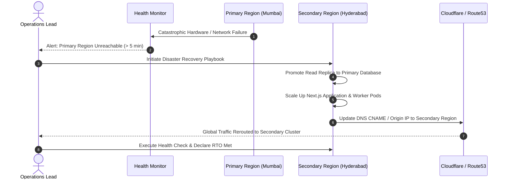

# Backup, Disaster Recovery & Business Continuity Architecture

## 1. Objectives & Recovery Targets (RTO / RPO)

**Status**: TARGET / PROPOSED

To guarantee institutional business continuity across thousands of schools and colleges, the platform enforces strict data protection targets:

- **Recovery Point Objective (RPO)**: **< 5 Minutes**. Maximum acceptable data loss in the event of catastrophic physical data center destruction.
- **Recovery Time Objective (RTO)**: **< 30 Minutes**. Maximum acceptable duration to restore full operational capability following a disaster.

---

## 2. Backup Topology & Cadence

| Backup Mechanism | Frequency | Storage Location | Retention Window | Verification Method |
| :--- | :--- | :--- | :--- | :--- |
| **Continuous WAL Archiving** | Real-time (streamed) | Isolated Cloud S3 Vault | 30 Days | Continuous point-in-time recovery capability. |
| **Automated Full Database Snapshots**| Daily at 02:00 IST | Encrypted Multi-Region S3 | 90 Days | Weekly automated restore to staging sandbox. |
| **Object Storage Versioning** | Continuous (on upload) | Cross-Region Replicated S3| 365 Days | S3 bucket versioning & Object Lock protection. |

---

## 3. Disaster Recovery Failover Procedure

---

## 4. Disaster Recovery Drills

1. **Quarterly Simulation**: Operations conducts scheduled failover drills in staging every 90 days to verify that replica promotion and DNS cutover execute within the 30-minute RTO.
2. **Data Integrity Audit**: Restored test snapshots are checked for foreign key consistency, tenant partitioning integrity, and audit log continuity.
