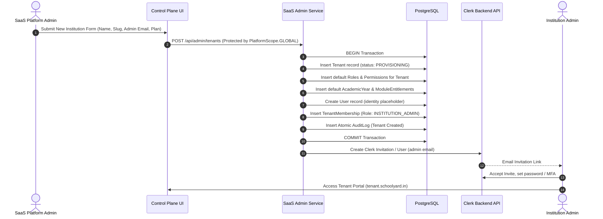
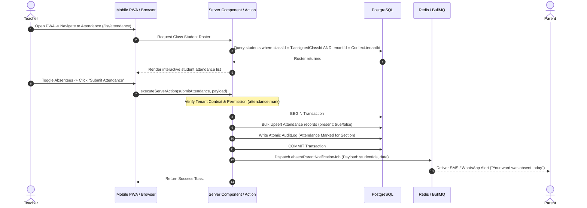

# Core User Journeys

## 1. Overview

**Status**: TARGET / PROPOSED

This document details the end-to-end operational user journeys for key personas across the platform lifecycle. Each journey outlines the initial trigger, interaction touchpoints, server-side authorization gates, and data mutation boundaries.

---

## 2. Journey 1: New Institution Onboarding & Tenant Provisioning

**Primary Persona**: SaaS Platform Admin & Institution Administrator

1. **Trigger**: Institution signs commercial agreement; Platform Admin initiates onboarding.
2. **Execution**: System provisions tenant record, default academic structures, and generates invitation.
3. **Verification**: Tenant resolution validates institutional slug; DB membership links Clerk identity to Admin role.

---

## 3. Journey 2: Teacher Daily Morning Attendance Routine

**Primary Persona**: Teacher (Class Teacher)

1. **Trigger**: Morning roll-call bell.
2. **Access Control**: Teacher is restricted to assigned class section (`TenantScope.ASSIGNED_ONLY`).
3. **Audit & Notifications**: Attendance records are transactionally committed; automated absentee alerts are enqueued asynchronously.

---

## 4. Journey 3: Examination Marks Entry & Gradebook Publishing

**Primary Persona**: Subject Teacher & Institution Admin

1. **Step 1: Exam Scheduling (Admin/Coordinator)**:
   - Admin configures Exam period (e.g. "Mid-Term Exam"), attaches subjects, defines max marks (e.g. 100), and assigns pass criteria.
2. **Step 2: Marks Entry (Subject Teacher)**:
   - Teacher logs in, selects subject and class, and opens the marks entry sheet.
   - Client validates scores within `0 <= score <= maxScore`.
   - Server Action verifies teacher's subject assignment and active tenant context.
   - Scores are saved in draft status (`Result.status = DRAFT`).
3. **Step 3: Verification & Approval (Department Head / Principal)**:
   - Administrator reviews class score distribution and grade averages.
   - Administrator clicks "Publish Results" (`exam.publish` permission required).
   - Results transition to `PUBLISHED`.
4. **Step 4: Parental Visibility**:
   - Parents immediately see published scores in their dashboard; notifications are enqueued for parent mobile alerts.

---

## 5. Journey 4: Parent Child Progress Review & Fee Payment (V1/V2)

**Primary Persona**: Parent / Legal Guardian

1. **Step 1: Multi-Student Selector**:
   - Parent logs into institution portal.
   - System queries `TenantMembership` and resolves all linked children via `StudentProfile.parentId`.
   - Parent selects child from switcher dropdown.
2. **Step 2: Academic Progress Inspection (V1)**:
   - Parent views real-time attendance rate (e.g. 94%), timetable for the current day, upcoming exams, and published assignment scores.
3. **Step 3: Fee Due Review & Digital Receipt (V2 Roadmap)**:
   - Parent navigates to `/parent/fees`.
   - Views outstanding quarterly tuition and transport fee breakdown.
   - Clicks "Pay Online", completes Razorpay transaction.
   - Webhook records payment receipt atomically; system generates digital invoice download.
