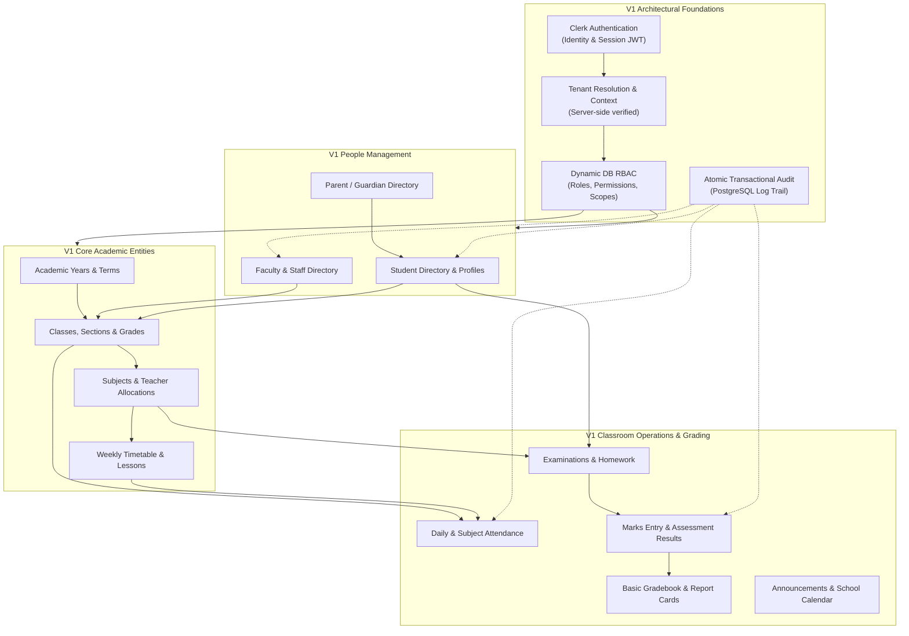
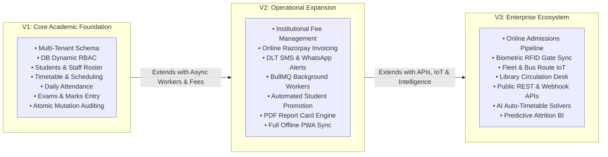
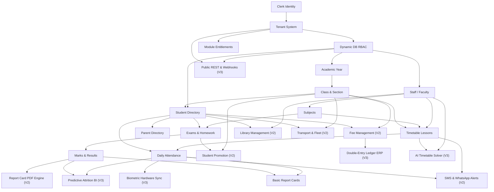

# Product Module Map, Evolution & Release Principles

## 1. Executive Release Principles

**Status**: DECISION

To ensure software excellence, prevent architectural churn, and maintain predictable delivery velocity, all product and engineering teams adhere to the **Eight Release Principles**:

1. **Foundations Before Feature Breadth (V1 Law)**:
   - V1 must establish rock-solid architectural foundations (tenant resolution, dynamic DB RBAC, atomic audit logging, service boundaries) before expanding into broad enterprise workflows.
2. **Backward-Compatible Architecture (V2 Law)**:
   - No V2 feature may force a breaking rewrite of V1 core architecture. V2 modules (fees, notifications, promotions) must attach cleanly as consumers of V1 domain services.
3. **Stable Contracts for the Ecosystem (V3 Law)**:
   - V3 enterprise and third-party capabilities must build on stable, versioned internal domain contracts and documented public APIs.
4. **Controlled Rollouts via Feature Entitlements**:
   - All newly introduced capabilities must be gated by the `ModuleEntitlement` licensing engine, enabling canary deployments, pilot institution testing, and tiered monetization.
5. **Independent Deployability of Heavy Workloads**:
   - High-throughput asynchronous workloads (bulk notifications, PDF compilation, data imports) must run in standalone worker daemons (BullMQ) to prevent web runner starvation.
6. **Screen Existence Does Not Equal Completion**:
   - A module is not "complete" merely because frontend screens or mock forms exist. It must satisfy the full 17-point Definition of Done (server guards, Zod validation, error handling, tests).
7. **Automated Test Coverage for Critical Workflows**:
   - No workflow touching student safety, academic marks, financial transactions, or tenant isolation may ship without passing automated unit, integration, and E2E browser tests.
8. **Universal Cross-Tenant Isolation**:
   - Cross-tenant data isolation is non-negotiable and mandatory for every single tenant-facing table, query, cache key, background job, and S3 file path.

---

## 2. Diagram 1: V1 Core Module Architecture

---

## 3. Diagram 2: V1 -> V2 -> V3 Evolution Roadmap

---

## 4. Diagram 3: Comprehensive Module Dependency Graph

