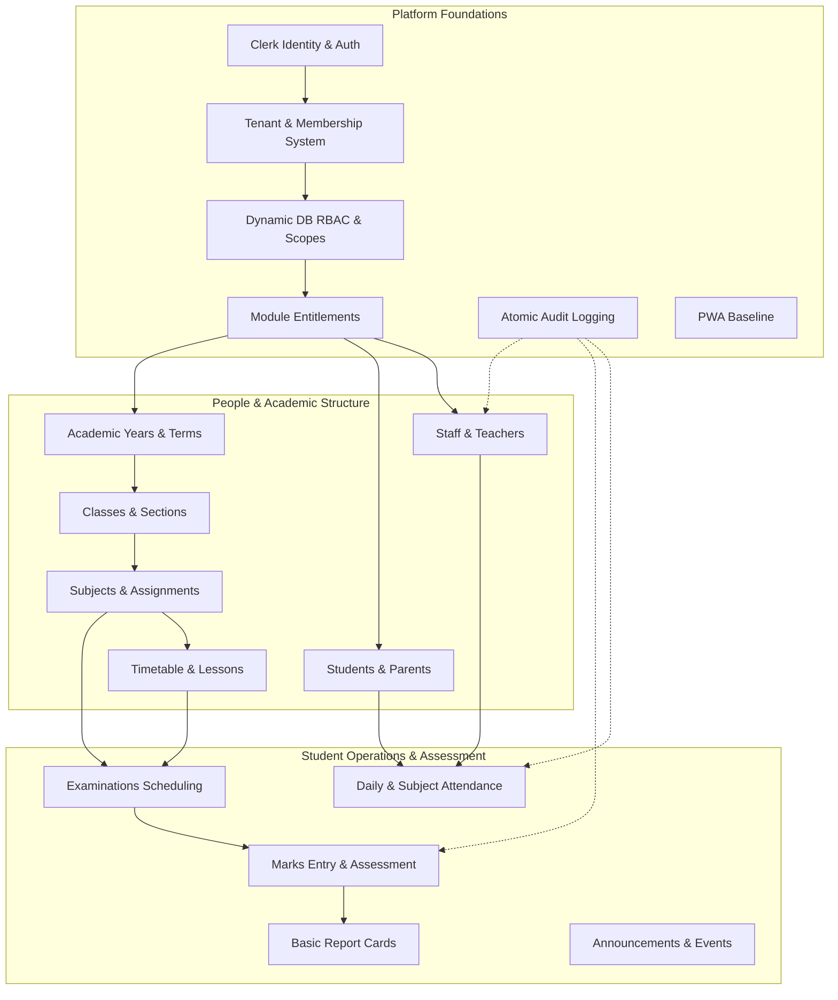

# V1 Product Scope: Core Institution Management Platform

## 1. Executive Summary & V1 Objectives

**Status**: TARGET / PROPOSED

**Version 1 (V1)** establishes the foundational, production-grade multi-tenant SaaS platform and delivers the core academic workflows necessary to operate a school or college. 

V1 deliberately bounds scope: it provides rock-solid institutional isolation, dynamic database RBAC, comprehensive academic scheduling, student/staff records, daily attendance, assessment grading, and report card compilation, while deferring complex financial accounting, admissions pipelines, and multi-branch transport to subsequent horizons.

---

## 2. High-Level V1 System Architecture Diagram

---

## 3. Detailed Specification for Every V1 Module

---

### Category A: Platform Foundation

#### A.1 Clerk Authentication & Application User Identity
- **Purpose**: Authenticate human actors securely via Clerk while mapping their external `sub` identity to an internal PostgreSQL `User` record.
- **Primary Users**: All Personas (Platform Admin, Institution Admin, Teachers, Students, Parents).
- **Core Workflows**:
  1. User signs in via email/password, phone OTP, or Google SSO.
  2. Clerk verifies credentials, executes MFA (if required), and issues session JWT.
  3. Next.js edge middleware validates token cryptographic signature.
  4. System resolves internal `User` record via `clerkId`.
- **Main Entities**: `User`, Clerk Identity JWT.
- **Required Permissions**: Public / Authenticated.
- **Tenant Boundary**: Identity is global across institutions (`User`), but institutional actions require a `TenantMembership`.
- **Screens**: `/[[...sign-in]]`, `/user/profile`.
- **Dependencies**: `@clerk/nextjs`, `@clerk/elements`.
- **Acceptance Criteria**:
  - JWT signature verified on edge without contacting Clerk backend API on every request.
  - Revoked sessions terminate access immediately.
- **Testing Requirements**:
  - Unit tests for session claim extraction.
  - Integration tests for mapping Clerk `sub` to internal `User` ID.

#### A.2 Tenant Management & Membership System
- **Purpose**: Partition all institutional data, resolve active tenant context server-side, and manage user bindings.
- **Primary Users**: SaaS Platform Admin, Institution Admin, End Users.
- **Core Workflows**:
  1. Platform Admin provisions new institution (Name, Slug, Domain).
  2. Server resolves tenant from incoming request host or path slug.
  3. Server validates authenticated user's `TenantMembership` record.
  4. Active `tenantId` is injected into `AsyncLocalStorage` context.
- **Main Entities**: `Tenant`, `TenantMembership`.
- **Required Permissions**: `tenant.create` (Platform), `tenant.settings.write` (Institution).
- **Tenant Boundary**: Enforces tenant boundary for all downstream database queries.
- **Screens**: SaaS Control Plane (`/admin/tenants`), Institution Settings (`/settings/institution`).
- **Dependencies**: Application Database, Next.js Edge Middleware.
- **Acceptance Criteria**:
  - Zero cross-tenant data access; requests without valid membership return `403 Forbidden`.
  - Client-controlled headers (e.g. `x-tenant-id`) are ignored unless validated against database membership.
- **Testing Requirements**:
  - Automated integration tests verifying query rejection when user lacks membership in target tenant.

#### A.3 Dynamic Database-Driven RBAC & Access Scopes
- **Purpose**: Authorize user actions using fine-grained atomic permissions and horizontal access scopes stored in PostgreSQL.
- **Primary Users**: Institution Admin, Staff, Students, Parents.
- **Core Workflows**:
  1. Admin assigns a named `Role` (e.g. "Class Teacher") to a `TenantMembership`.
  2. Guarded Action evaluates whether the role contains the target permission string.
  3. System evaluates `AccessScope` (e.g. `ASSIGNED_ONLY` checks if teacher is linked to class).
- **Main Entities**: `Role`, `Permission`, `RolePermission`, `TenantMembership`.
- **Required Permissions**: `rbac.role.manage`, `rbac.permission.assign`.
- **Tenant Boundary**: Scoped to `tenantId`. Standard system roles exist, but institutions can customize role assignments.
- **Screens**: `/admin/roles`, `/admin/roles/[id]`.
- **Dependencies**: PostgreSQL, `createGuardedAction` wrapper.
- **Acceptance Criteria**:
  - Zero authorization checks rely on Clerk `publicMetadata`.
  - Unprivileged requests return `403 Forbidden` with sanitized error message.
- **Testing Requirements**:
  - Unit tests for RBAC policy evaluation engine across all 6 access scopes.

#### A.4 Module Entitlements & Feature Licensing
- **Purpose**: Control which functional product modules are active for an institution based on subscription tier and overrides.
- **Primary Users**: SaaS Platform Admin, Institution Admin.
- **Core Workflows**:
  1. Platform Admin sets institution's plan (`Standard`, `Enterprise`).
  2. System resolves active module keys (`core_academics`, `attendance_module`).
  3. Navigation menu hides unlicensed modules; Server Actions reject unentitled execution.
- **Main Entities**: `SubscriptionPlan`, `ModuleEntitlement`, `TenantOverride`.
- **Required Permissions**: `platform.entitlements.manage`.
- **Tenant Boundary**: Scoped per `Tenant`.
- **Screens**: SaaS Admin Subscription Panel, Feature Access Advisory.
- **Dependencies**: Redis cache for fast entitlement lookups.
- **Acceptance Criteria**:
  - Disabled modules block both UI navigation and direct Server Action invocations.
- **Testing Requirements**:
  - Integration tests verifying route and action gating when module is disabled.

#### A.5 Atomic Audit Logging
- **Purpose**: Record legally defensible, tamper-evident audit trails for all sensitive database mutations within the exact same transaction.
- **Primary Users**: Institution Admin, SaaS Super Admin, Compliance Auditors.
- **Core Workflows**:
  1. Business service executes database mutation inside `prisma.$transaction`.
  2. Service inserts `AuditLog` record containing actor ID, old state, new state, and remark.
  3. Both commit together; if audit insert fails, entire mutation rolls back.
- **Main Entities**: `AuditLog`.
- **Required Permissions**: `audit.log.read`, `audit.log.export`.
- **Tenant Boundary**: Strictly scoped to `tenantId`. Append-only; zero update/delete permissions.
- **Screens**: `/admin/audit-logs`.
- **Dependencies**: PostgreSQL Interactive Transactions.
- **Acceptance Criteria**:
  - Audit log entries commit atomically with the mutation. Zero reliance on message queues for critical logs.
- **Testing Requirements**:
  - Integration tests asserting mutation rollback when audit log insert fails.

#### A.6 Basic Notification Foundation
- **Purpose**: Deliver in-app operational toasts and queue basic email/SMS triggers for urgent alerts.
- **Primary Users**: Teachers, Parents, Administrators.
- **Core Workflows**:
  1. Event occurs (e.g. student marked absent).
  2. Domain service writes in-app notification record and dispatches background job.
- **Main Entities**: `NotificationRecord`, `NotificationPreference`.
- **Required Permissions**: Authenticated User.
- **Tenant Boundary**: Scoped to `tenantId`.
- **Screens**: Notification center popover, banner alerts.
- **Dependencies**: React Toastify (client), BullMQ + Redis (worker foundation).
- **Acceptance Criteria**:
  - In-app toasts fire reliably upon mutation success/failure.
- **Testing Requirements**:
  - Unit tests for notification template rendering and variable substitution.

#### A.7 Progressive Web App (PWA) Foundation
- **Purpose**: Enable mobile home-screen installation and basic asset caching for low-bandwidth institutional environments.
- **Primary Users**: Mobile Teachers, Students, Parents.
- **Core Workflows**:
  1. User opens portal on Android/iOS browser.
  2. Service worker registers and precaches static assets (CSS, JS, Fonts).
  3. Browser displays "Add to Home Screen" prompt.
- **Main Entities**: `manifest.webmanifest`, `sw.js`.
- **Required Permissions**: Public.
- **Tenant Boundary**: Manifest dynamically includes institutional short name and theme color.
- **Screens**: PWA install modal, offline fallback screen.
- **Dependencies**: `@serwist/next` (or native Service Worker).
- **Acceptance Criteria**:
  - Passes Google Lighthouse PWA compliance audit; loads offline fallback when network is absent.
- **Testing Requirements**:
  - Playwright browser test verifying service worker registration and manifest fetch.

---

### Category B: People Management

#### B.1 Staff & Teacher Management
- **Purpose**: Maintain comprehensive records of institutional faculty, administrative staff, departmental assignments, and designations.
- **Primary Users**: Institution Admin, Academic Supervisors.
- **Core Workflows**:
  1. Admin onboards new teacher (Personal info, Employee Code, Designation, Subjects).
  2. System creates `User`, `TenantMembership` (Role: Teacher), and `StaffProfile`.
  3. Teacher is assigned as class supervisor or subject instructor.
- **Main Entities**: `StaffProfile`, `TenantMembership`, `TeacherSubject`, `Class`.
- **Required Permissions**: `teacher.profile.read`, `teacher.profile.write`, `teacher.assignment.write`.
- **Tenant Boundary**: Scoped to `tenantId`. Employee codes are unique per tenant (`@@unique([tenantId, employeeCode])`).
- **Screens**: `/list/teachers`, `/list/teachers/[id]`, Teacher Form Dialog.
- **Dependencies**: Clerk Identity Invites, S3 Photo Storage.
- **Acceptance Criteria**:
  - Password updates execute cleanly via Clerk without crashing Prisma.
  - Single teacher view displays assigned classes and real timetable slots.
- **Testing Requirements**:
  - Integration tests for staff onboarding and class supervisor linkage.

#### B.2 Student Management
- **Purpose**: Manage student admission lifecycle, personal records, class allocations, and guardian linkages.
- **Primary Users**: Institution Admin, Class Teachers, Parents.
- **Core Workflows**:
  1. Admission office enters student records, generates Admission Number, and assigns to Section.
  2. System links student profile to primary `ParentProfile`.
  3. Single student dashboard displays personal KPIs, timetable, and attendance rates.
- **Main Entities**: `StudentProfile`, `Class`, `Grade`, `ParentProfile`, `Attendance`.
- **Required Permissions**: `student.profile.read`, `student.profile.write`.
- **Tenant Boundary**: Scoped to `tenantId`. Admission numbers unique per tenant (`@@unique([tenantId, admissionNumber])`).
- **Screens**: `/list/students`, `/list/students/[id]`, Student Form Dialog.
- **Dependencies**: Class & Grade modules.
- **Acceptance Criteria**:
  - Attendance rate calculation handles 0-day edge cases without rendering `NaN%`.
  - Student cannot be enrolled in two active classes simultaneously.
- **Testing Requirements**:
  - E2E test verifying student creation, parent linking, and profile view rendering.

#### B.3 Parent & Guardian Directory
- **Purpose**: Maintain parent/guardian contact records and map multiple student dependents to family guardians.
- **Primary Users**: Institution Admin, Office Staff, Parents.
- **Core Workflows**:
  1. Office staff creates parent profile with verified mobile and email.
  2. Multiple students are linked to a single parent account.
  3. Parent logs in and toggles between enrolled children via child switcher.
- **Main Entities**: `ParentProfile`, `StudentProfile`, `TenantMembership`.
- **Required Permissions**: `parent.read`, `parent.write`.
- **Tenant Boundary**: Scoped to `tenantId`. Phone numbers indexed per tenant.
- **Screens**: `/list/parents`, Parent Linkage Dialog.
- **Dependencies**: Student Module.
- **Acceptance Criteria**:
  - Resolves `deleteSubject` routing bug in `FormModal.tsx`; parent deletions route to `parentService.delete()`.
- **Testing Requirements**:
  - Unit tests for family multi-student linkage and resolver.

#### B.4 User Profile Management
- **Purpose**: Allow individual users to view their account details, change passwords, and configure notification preferences.
- **Primary Users**: All Personas.
- **Core Workflows**:
  1. User clicks avatar in Navbar -> selects "My Profile".
  2. Updates personal contact info or initiates password reset via Clerk.
- **Main Entities**: `User`, `TenantMembership`.
- **Required Permissions**: `TenantScope.SELF_ONLY`.
- **Tenant Boundary**: Self-profile view.
- **Screens**: `/user/profile`, `/settings/preferences`.
- **Dependencies**: Clerk User Profile elements.
- **Acceptance Criteria**:
  - Users can update allowed self-fields without privilege escalation.
- **Testing Requirements**:
  - Security tests verifying a student cannot modify their assigned role or class ID.

---

### Category C: Academics & Scheduling

#### C.1 Academic Year & Terms Management
- **Purpose**: Structure institutional time into academic sessions (e.g. "2026-2027") and grading terms (Term 1, Mid-Term, Final).
- **Primary Users**: Institution Admin.
- **Core Workflows**:
  1. Admin defines new Academic Year with start and end dates.
  2. Sets active academic year for current operational semester.
  3. Historical academic years become read-only upon closure.
- **Main Entities**: `AcademicYear`, `AcademicTerm`.
- **Required Permissions**: `academic.year.manage`.
- **Tenant Boundary**: Scoped to `tenantId`. Exactly one academic year is marked `isCurrent = true` per tenant.
- **Screens**: `/admin/academic-years`.
- **Dependencies**: None.
- **Acceptance Criteria**:
  - All class enrollments, marks, and attendance records link to an active `academicYearId`.
- **Testing Requirements**:
  - Integration tests for active term transitions and historical locking.

#### C.2 Grades, Classes & Sections
- **Purpose**: Define academic standards (Grades 1 to 12) and divisible class sections (e.g. "Grade 10 - Section A").
- **Primary Users**: Institution Admin, Teachers.
- **Core Workflows**:
  1. Admin configures Grades and creates Class sections with capacity limits.
  2. Assigns a senior faculty member as Section Supervisor (Class Teacher).
- **Main Entities**: `Grade`, `Class`, `StaffProfile`.
- **Required Permissions**: `class.read`, `class.write`.
- **Tenant Boundary**: Scoped to `tenantId`. Composite unique index on `@@unique([tenantId, name])`.
- **Screens**: `/list/classes`, Class Form Dialog.
- **Dependencies**: Academic Year, Staff Module.
- **Acceptance Criteria**:
  - Fixes `Grade.classess` relation typo in Prisma schema.
  - Class names are unique per institution, not globally.
- **Testing Requirements**:
  - Integration tests for section capacity enforcement and supervisor assignment.

#### C.3 Subjects & Teacher Allocations
- **Purpose**: Catalog curriculum subjects (Mathematics, Science, History) and map certified instructors to subjects.
- **Primary Users**: Institution Admin, Academic Coordinators.
- **Core Workflows**:
  1. Admin defines Subject with code and credits.
  2. Links multiple qualified teachers to the subject.
- **Main Entities**: `Subject`, `StaffProfile`, `SubjectTeacher`.
- **Required Permissions**: `subject.read`, `subject.write`.
- **Tenant Boundary**: Scoped to `tenantId`. Composite unique index on `@@unique([tenantId, code])`.
- **Screens**: `/list/subjects`, Subject Form Dialog.
- **Dependencies**: Staff Module.
- **Acceptance Criteria**:
  - Multiple schools can create "Physics" without database unique collisions.
- **Testing Requirements**:
  - Integration tests for many-to-many teacher-subject allocations.

#### C.4 Timetable & Weekly Period Scheduling
- **Purpose**: Construct weekly class and teacher timetables with period slots, break times, and room allocations.
- **Primary Users**: Academic Coordinators, Teachers, Students.
- **Core Workflows**:
  1. Admin sets period timetable grid (Days: Monday to Saturday; Periods: 1 to 8).
  2. Assigns `Lesson` (Subject + Class + Teacher + Room + Time Slot).
  3. System validates against teacher double-booking and room collisions.
  4. Students and teachers view responsive weekly timetable calendar.
- **Main Entities**: `Lesson`, `Subject`, `Class`, `StaffProfile`.
- **Required Permissions**: `timetable.read`, `timetable.write`.
- **Tenant Boundary**: Scoped to `tenantId`.
- **Screens**: `/list/lessons`, `BigCalenderContainer` view.
- **Dependencies**: React Big Calendar, Subject, Class, Staff.
- **Acceptance Criteria**:
  - Calendar supports Saturday schedule toggle; eliminates in-place date mutations in `src/lib/utils.ts`.
  - Double-booking conflict returns a clear validation error.
- **Testing Requirements**:
  - Unit tests for timetable conflict detection algorithms and date helpers.

---

### Category D: Student Operations

#### D.1 Daily & Subject Attendance Marking
- **Purpose**: Record morning roll-call attendance for class sections and period-level attendance for subject lessons.
- **Primary Users**: Class Teachers, Subject Teachers, School Administrators.
- **Core Workflows**:
  1. Teacher navigates to `/list/attendance`, selects assigned section.
  2. Roster displays all enrolled students (defaulting to "Present").
  3. Teacher toggles absentees/tardies and clicks "Submit Attendance".
  4. Server commits attendance records atomically and logs audit entry.
- **Main Entities**: `Attendance`, `StudentProfile`, `Class`, `Lesson`.
- **Required Permissions**: `attendance.read`, `attendance.mark`, `attendance.correct`.
- **Tenant Boundary**: Scoped to `tenantId`. Composite unique constraint on `@@unique([tenantId, studentId, date, lessonId])`.
- **Screens**: `/list/attendance` (Dedicated Route), Attendance Sheet Dialog.
- **Dependencies**: Student, Class, and Lesson modules.
- **Acceptance Criteria**:
  - Implements the missing `/list/attendance` route identified in Step 0.
  - Submitting attendance is restricted to the teacher assigned to that section/lesson.
- **Testing Requirements**:
  - Integration tests for bulk attendance upsert and audit logging.

#### D.2 Student Academic Profile & Record History
- **Purpose**: Provide a unified 360-degree view of a student's institutional journey (attendance records, current marks, disciplinary remarks).
- **Primary Users**: Teachers, Parents, Students.
- **Core Workflows**:
  1. User navigates to `/list/students/[id]`.
  2. System resolves student, calculates attendance percentage, and loads recent exam scores.
- **Main Entities**: `StudentProfile`, `Attendance`, `Result`, `Class`.
- **Required Permissions**: `student.profile.read` (scoped to `ASSIGNED_ONLY`, `LINKED_CHILDREN`, or `SELF_ONLY`).
- **Tenant Boundary**: Scoped to `tenantId`.
- **Screens**: `/list/students/[id]`.
- **Dependencies**: Student, Attendance, Exam modules.
- **Acceptance Criteria**:
  - Zero IDOR vulnerability; parent of School A cannot load student of School B.
- **Testing Requirements**:
  - Security integration tests verifying cross-tenant IDOR rejection on `[id]` route.

---

### Category E: Assessment & Grading

#### E.1 Examinations Management
- **Purpose**: Schedule examination periods, attach curriculum subjects, and set maximum/passing mark thresholds.
- **Primary Users**: Exam Coordinators, Teachers.
- **Core Workflows**:
  1. Coordinator creates Exam (e.g. "Mid-Term Examination 2026").
  2. Configures individual subject papers, dates, start/end times, and max marks (e.g. 100).
- **Main Entities**: `Exam`, `Lesson`, `Subject`, `AcademicTerm`.
- **Required Permissions**: `exam.read`, `exam.create`, `exam.update`, `exam.publish`.
- **Tenant Boundary**: Scoped to `tenantId`.
- **Screens**: `/list/exams`, Exam Form Dialog.
- **Dependencies**: Subject, Academic Term.
- **Acceptance Criteria**:
  - Server Actions verify `exam.create` permission; checks are not commented out.
- **Testing Requirements**:
  - Integration tests for exam scheduling and date validation.

#### E.2 Assignments & Homework
- **Purpose**: Distribute homework assignments, deadlines, and submission instructions to class sections.
- **Primary Users**: Subject Teachers, Students, Parents.
- **Core Workflows**:
  1. Teacher posts assignment with title, description, attached reading, and due date.
  2. Students view active assignments in their dashboard.
- **Main Entities**: `Assignment`, `Lesson`, `Subject`.
- **Required Permissions**: `assignment.read`, `assignment.write`.
- **Tenant Boundary**: Scoped to `tenantId`.
- **Screens**: `/list/assignments`, Assignment Form Dialog.
- **Dependencies**: Lesson and Subject modules.
- **Acceptance Criteria**:
  - Replaces `deleteSubject` bug in `FormModal.tsx` with dedicated `deleteAssignment` action.
- **Testing Requirements**:
  - E2E test for assignment creation and student view verification.

#### E.3 Marks Entry & Assessment Results
- **Purpose**: Enable instructors to enter student assessment marks, validate score boundaries, and compute class statistics.
- **Primary Users**: Subject Teachers, Academic Administrators.
- **Core Workflows**:
  1. Teacher selects exam paper and class section.
  2. Enters scores into tabular grid; client validates `0 <= score <= maxScore`.
  3. Teacher submits marks in `DRAFT` status; Administrator reviews and approves `PUBLISHED`.
- **Main Entities**: `Result`, `Exam`, `StudentProfile`.
- **Required Permissions**: `result.read`, `result.write`, `result.publish`.
- **Tenant Boundary**: Scoped to `tenantId`. Composite unique index on `@@unique([tenantId, examId, studentId])`.
- **Screens**: `/list/results`, Marks Entry Grid Dialog.
- **Dependencies**: Exam and Student modules.
- **Acceptance Criteria**:
  - Overriding published marks requires an administrative remark and generates an atomic audit log.
- **Testing Requirements**:
  - Integration tests for score validation, draft/publish lifecycle, and audit log emission.

#### E.4 Report Cards Compilation
- **Purpose**: Calculate consolidated student term grades and render standardized institutional report cards.
- **Primary Users**: Institution Admin, Teachers, Parents, Students.
- **Core Workflows**:
  1. System calculates term totals, percentages, and grade letters (A, B, C, D, F).
  2. Generates digital student report card viewable online.
- **Main Entities**: `ReportCard`, `Result`, `StudentProfile`.
- **Required Permissions**: `report.read`, `report.generate`.
- **Tenant Boundary**: Scoped to `tenantId`.
- **Screens**: `/list/students/[id]/report-card`, Print View.
- **Dependencies**: Result, Attendance, Student modules.
- **Acceptance Criteria**:
  - Accurately renders grade letters based on configured institutional grading scale.
- **Testing Requirements**:
  - Unit tests for grading algorithm calculations and rounding rules.

---

### Category F: Institutional Communication

#### F.1 Announcements & Bulletins
- **Purpose**: Publish institutional notices, circulars, and announcements targeted by audience role.
- **Primary Users**: Institution Admin, All Users.
- **Core Workflows**:
  1. Admin creates announcement (Title, Body, Target Audience: All, Teachers, Students, Parents).
  2. Notice appears on dashboard feed of targeted users.
- **Main Entities**: `Announcement`, `Class`.
- **Required Permissions**: `announcement.read`, `announcement.write`.
- **Tenant Boundary**: Scoped to `tenantId`.
- **Screens**: `/list/announcements`, Announcement Form Dialog.
- **Dependencies**: Target audience roles.
- **Acceptance Criteria**:
  - Announcements scoped to specific classes are hidden from students in other classes.
- **Testing Requirements**:
  - Integration tests for audience-filtered announcement queries.

#### F.2 School Events & Institutional Calendar
- **Purpose**: Schedule institutional events, holidays, sports meets, and parent-teacher meetings on a shared calendar.
- **Primary Users**: All Personas.
- **Core Workflows**:
  1. Admin posts school event with date/time range and description.
  2. Renders on dashboard mini-calendar (`EventCalendar.tsx`) and events list.
- **Main Entities**: `Event`, `Class`.
- **Required Permissions**: `event.read`, `event.write`.
- **Tenant Boundary**: Scoped to `tenantId`.
- **Screens**: `/list/events`, Event Form Dialog.
- **Dependencies**: React Calendar.
- **Acceptance Criteria**:
  - Replaces delete bug with dedicated `deleteEvent` action; events reflect institutional timezone.
- **Testing Requirements**:
  - Integration tests for date-bounded event queries.

---

### Category G: Core Platform Capabilities

#### G.1 Search, Filtering & Pagination
- **Purpose**: Provide consistent, high-performance search and pagination across all tabular list screens.
- **Primary Users**: All Personas.
- **Core Workflows**:
  1. User types in search bar -> debounced server query executes `ILIKE` on name/code.
  2. Dropdown filters apply relational constraints (e.g. filter students by `classId`).
  3. Server returns paginated records with total count and page metadata.
- **Main Entities**: All Domain Entities.
- **Required Permissions**: Inherited from entity read permissions.
- **Tenant Boundary**: Scoped to `tenantId`.
- **Screens**: Standardized across all 11 list views.
- **Dependencies**: `TableSearch.tsx`, `Pagination.tsx`.
- **Acceptance Criteria**:
  - Pagination limits records to 10 per page; total pages calculate accurately.
- **Testing Requirements**:
  - Integration tests verifying pagination bounds and SQL injection safety in search queries.

#### G.2 Role-Based Dashboards & Navigation Shell
- **Purpose**: Present distinct home screen layouts tailored to the active user's role and permissions.
- **Primary Users**: Admin, Teacher, Student, Parent.
- **Core Workflows**:
  1. User logs in -> redirected to `/admin`, `/teacher`, `/student`, or `/parent`.
  2. Sidebar menu displays links only for permitted and entitled modules.
  3. Dashboard renders role-specific summary cards, schedules, and shortcuts.
- **Main Entities**: `UserCard`, `AttendanceChart`, `CountChart`, `Menu`.
- **Required Permissions**: Role-specific dashboard view permission.
- **Tenant Boundary**: Scoped to active `tenantId`.
- **Screens**: `/admin`, `/teacher`, `/student`, `/parent`.
- **Dependencies**: All underlying domain modules.
- **Acceptance Criteria**:
  - Replaces hardcoded tutorial stats with live database counts scoped to the active tenant.
- **Testing Requirements**:
  - Playwright E2E tests verifying correct dashboard routing for all 4 roles.
